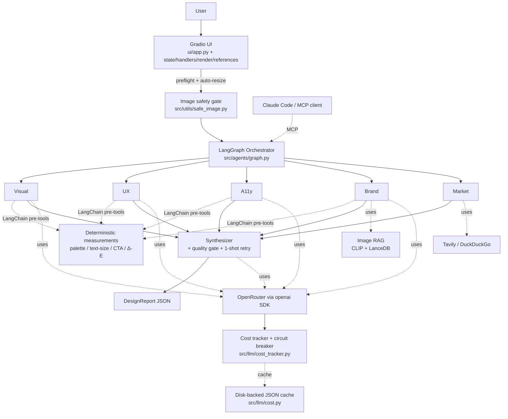

# Multimodal AI Design Analysis Suite

> A multi-agent LangGraph system that reviews uploaded UI/product designs.
> Five specialists run in parallel — visual, UX, accessibility, brand, and
> market — over an image-RAG corpus. The synthesizer aggregates everything
> into a typed `DesignReport`. Built for the C7 Engineering Accelerator
> hackathon.

## What it does

1. Drag a design screenshot into the Gradio UI (or call `analyze_design`
   over MCP from Claude Code or any other MCP-compatible client).
2. Five specialist agents fan out concurrently. Each returns a Pydantic
   model — no markdown, no prose.
3. The synthesizer aggregates the five outputs into a `DesignReport` with
   top-3 strengths, top-5 prioritized recommendations, and an overall score.

## Architecture (one mermaid diagram)



The full diagram set lives in `docs/ARCHITECTURE.md` and the interactive
walkthrough in `docs/walkthrough.html`.

### What is in the diagram that is not in the curriculum

Five robustness pillars wrap the multi-agent core. They are what turns
this from a class project into something close to a product:

1. **Image safety gate** (`src/utils/safe_image.py`) — preflight every
   upload (suffix allowlist, 20 MB cap, 4 MP cap), then auto-resize to
   1024 px before the pipeline ever sees the file.
2. **LangChain `@tool` pre-tools** (`src/agents/tools.py`) — k-means
   palette in CIELab, OpenCV text-size, CTA-density heuristic, Δ-E
   palette distance. Run BEFORE the LLM, ground the prompt in measured
   facts, save tokens.
3. **Anti-hallucination prompt scaffolding** (`src/utils/prompts/`) —
   every system prompt carries an `ANTI_HALLUCINATION_RULE` and an
   `ABSTENTION_RULE`. Prompts are pinned by regression tests.
4. **Cost tracker + circuit breaker** (`src/llm/cost_tracker.py`) —
   per-run telemetry visible in Settings; fast-fail after 2 hard
   failures so a typo'd API key cannot burn 25 doomed network calls.
5. **Quality gate + 1-shot synthesizer retry** (`src/agents/quality_gate.py`)
   — pure-Python content checks; if a `fail`-severity issue is found
   in the first synthesizer output, ONE corrective re-prompt is sent.

All five are implemented today. None of them ship as buzzwords; each
has a one-page section in `docs/ARCHITECTURE.md`.

## Quickstart

### Run the offline path first (no keys, no network, no GPU)

**Linux / macOS:**

```bash
git clone <this-repo-url> ai_c7_hackathon && cd ai_c7_hackathon
python3 -m venv .venv && source .venv/bin/activate
pip install -e ".[dev]" -r requirements/all.txt
make test                        # 56 tests, ~8 seconds
make run-a                       # full graph against the bundled sample, all fakes
```

**Windows (PowerShell):**

```powershell
git clone <this-repo-url> ai_c7_hackathon ; cd ai_c7_hackathon
python -m venv .venv ; .venv\Scripts\Activate.ps1
pip install -e ".[dev]" -r requirements/all.txt
# `make` is not native on Windows. Either install GnuWin32 / Chocolatey
# `choco install make` (recommended), or run the equivalent commands directly:
pytest -q                                   # equivalent to `make test`
python -m src.agents.graph --image src/fakes/fixtures/sample.png  # equivalent to `make run-a`
```

> Every Makefile target maps to a one-line `python -m ...` command. Open
> the `Makefile` (it's short, ~50 lines) to see the equivalent if you'd
> rather not install `make`.

### Switch on real APIs

1. **Get an OpenRouter key** at https://openrouter.ai/keys (sign in → "Create
   Key"). Add $5 of credits — that lasts the entire hackathon.
2. (Optional) **Tavily** at https://app.tavily.com/home for nicer market-
   research snippets — 1,000 queries/month free. Skip it and the code falls
   back to free DuckDuckGo automatically.
3. (Optional) **LangSmith** at https://smith.langchain.com/settings →
   "API Keys" for traces — 5,000 traces/month free.

**Copy the env template:**

```bash
# Linux / macOS:
cp .env.example .env

# Windows (PowerShell):
Copy-Item .env.example .env
```

Open `.env` in your editor and edit at minimum:

```
OPENROUTER_API_KEY=sk-or-v1-...
TAVILY_API_KEY=tvly-...                        # optional
LANGCHAIN_API_KEY=lsv2_pt_...                  # optional
LANGCHAIN_TRACING_V2=true                      # optional
USE_REAL=1                                     # flip 0 → 1
```

**Verify the key loaded** (works on every OS):

```bash
python -c "from src.config import settings; print('OR key set:', bool(settings.openrouter_api_key))"
# Expect:  OR key set: True
```

**Run end-to-end:**

```bash
# Linux / macOS:
make ingest                                        # build the LanceDB corpus from data/reference/*.png
USE_REAL=1 make ui                                 # Gradio at http://127.0.0.1:7860

# Windows (PowerShell):
python -m scripts.ingest_references --source .\data\reference
$env:USE_REAL="1" ; python -m ui.app
```

Per-slice setup (just *your* keys, just *your* deps) is in
`docs/PERSON_<A|B|C|D|E>.md` — each starts with a "Setup — first 5 minutes"
block listing exactly which keys you personally need and which you can
skip.

## Per-person quickstart

| Person | Slice | Install | Smoke run |
|---|---|---|---|
| A | Infra & orchestration | `make install-a` | `make run-a` |
| B | Image RAG | `make install-b` | `make ingest && make run-b` |
| C | Visual + Brand agents | `make install-c` | `make run-c-visual && make run-c-brand` |
| D | UX + Accessibility agents | `make install-d` | `make run-d-ux && make run-d-a11y` |
| E | Market + UI + MCP | `make install-e` | `make ui` and `make mcp` |

Per-person READMEs in `docs/PERSON_*.md` explain the mission, contracts,
hot-spots, and "done when" checklist for each slice.

## Repo layout

```
app.py                       Hugging Face Spaces entry point — imports ui.app:main
requirements.txt             HF Spaces dependency manifest

src/
  config.py                  settings (pydantic-settings)
  contracts.py               Protocol classes — the seams between people
  schemas/outputs.py         every cross-module Pydantic model
  fakes/                     deterministic doubles for offline development
  llm/
    openrouter_client.py     real LLMClient over OpenRouter
    multimodal.py            vision message builder + encoder
    cost.py                  disk-backed JSON cache + @cached decorator
    cost_tracker.py          process-wide cost telemetry + circuit breaker
    hf_local.py              Sprint 2 HF concept stub
  rag/
    embedder.py              CLIP image+text embedder
    vector_store.py          LanceDB schema + open/get_or_create
    retriever.py             retrieve_by_image / retrieve_by_text
    editorial_refs.py        hand-curated fallback when RAG + web are empty
  tools/
    web_search.py            Tavily / DuckDuckGo provider
    image_utils.py           side_by_side composite (saves tokens)
    rag_tool.py              LangChain BaseTool wrapper around Retriever
  agents/
    base.py                  AgentDeps + run_with_schema helper
    {visual_analysis,ux_critique,accessibility,brand_consistency,market_research}.py
    synthesizer.py           fan-in node + quality-gate retry loop
    graph.py                 LangGraph wiring + plain-Python fallback
    tools.py                 LangChain @tool pre-tools (palette, text size, CTA, Δ-E)
                             + basic tools (read_file, list_files, web_search)
    quality_gate.py          pure-Python content checks for DesignReport
    _color_math.py           CIELab / k-means / hex helpers (used by tools)
  utils/
    logger.py                loguru-based logger
    tracing.py               LangSmith init + traced(...) context manager
    safe_image.py            preflight + downsize for every upload
    prompts/                 prompt PACKAGE: one file per agent
      _shared.py             JSON / EVIDENCE / ANTI_HALLUCINATION /
                             ABSTENTION / SELF_CHECK / TONE rules
      visual.py / ux.py / market.py / accessibility.py /
      brand.py / synthesizer.py
  evals/                     schema-validity harness
  mcp/server.py              stdio MCP server (analyze_design, search_designs)

ui/
  app.py                     Gradio Blocks — entry point + main()
  state.py                   settings refresh + status / settings cards
  handlers.py                on_run + classify_run_error (graceful errors)
  render.py                  premium DesignReport HTML rendering
  references.py              References-tab payload + ad-hoc search
  styles.py                  loads APP_CSS + light-theme JS / HEAD HTML
  static/app.css             actual CSS (1.3k lines, real .css file)

scripts/                     ingest_references, run_evals
tests/
  conftest.py                shared fixtures
  test_{schemas,contracts,fakes,prompts,tools,safe_image,quality_gate,
        editorial_refs}.py   cross-cutting (everyone runs)
  person_a..e/               per-slice tests
docs/
  PERSON_*.md                per-person READMEs
  ARCHITECTURE.md, DEMO_SCRIPT.md, CONCEPT_COVERAGE.md
  COST_DISCIPLINE.md, DEPLOY_HF.md, FAQ.md
  walkthrough.html           self-contained interactive flow demo
```

## Concept coverage

See `docs/CONCEPT_COVERAGE.md` for the full mapping of accelerator concepts
to file paths. Every Sprint 1-6 has a real artifact the judges can point at.

## FAQ — design choices, deployment, debug

`docs/FAQ.md` answers the recurring questions:

- Why `temperature=0.2` (not the chat default 0.7)?
- How are images passed to the LLM (data URLs, no OCR)?
- Is this a "model council" like Perplexity? (No — panel of experts.)
- Will it run on Hugging Face Spaces / Vercel? (Yes / no.)
- Is everything open-source? (Libraries yes; OpenRouter is paid SaaS but
  every paid service has a working free fallback wired in.)
- Will errors be visible when I run? (Yes — every agent boundary logs.)
- Why is there an MCP server? (Sprint 4, plus the demo magic moment —
  any MCP-compatible coding agent can call our graph as a native tool.)

## Deploy

| Target | Verdict | Notes |
|---|---|---|
| Hugging Face Spaces (Gradio SDK) | **Recommended** — see `docs/DEPLOY_HF.md` | Free CPU tier; YAML metadata at the top of this README is HF-ready |
| Render / Fly.io | Works fine | Long-running container + persistent disk |
| Vercel | Not recommended | Serverless 60 s timeout, no persistent disk; would require rewriting Gradio as Next.js |
| Local laptop | Hackathon demo target | Zero cost |

Cost-conscious budget for one full demo run with real APIs:
**≈ $0.0035** at the default `gpt-4o-mini` model; cache turns repeats
into free runs. Full breakdown in `docs/COST_DISCIPLINE.md`.

## What we did NOT build (honest list)

- Production-scale orchestration (Celery / Temporal). Replaced by in-process
  LangGraph plus a documented swap.
- Distributed Redis cache. Replaced by a disk-backed JSON cache.
- Multi-tenant LanceDB / per-tenant API keys. Single tenant for v1.
- HTTP MCP transport. stdio only.
- LLM-as-judge in evals. Schema-validity only — accurate enough for judging.
- Streaming token-by-token UI. Status updates per agent are emitted, the
  final report renders at end of run.
- Distributed tracing across services. LangSmith covers the LangGraph run.

The full "what we'd do for production" list is in
`docs/walkthrough.html` → **Scaling** tab.

## Tech stack

OpenRouter via `openai` SDK · LangGraph · LangChain-core (with `@tool`
decorator wiring) · LangSmith · LanceDB · open_clip_torch · LlamaIndex
(concept claim) · Pydantic v2 + pydantic-settings · Gradio · Tavily /
DuckDuckGo (auto fallback) · MCP Python SDK · OpenCV + Pillow + NumPy
(deterministic pre-tools) · pytest · ruff · black · mypy.

One library per concept — no duplicates.

## License & acknowledgements

MIT. Built by the C7 Hackathon Multimodal Group 1. Thanks to the Engineering
Accelerator Program for an excellent curriculum.
