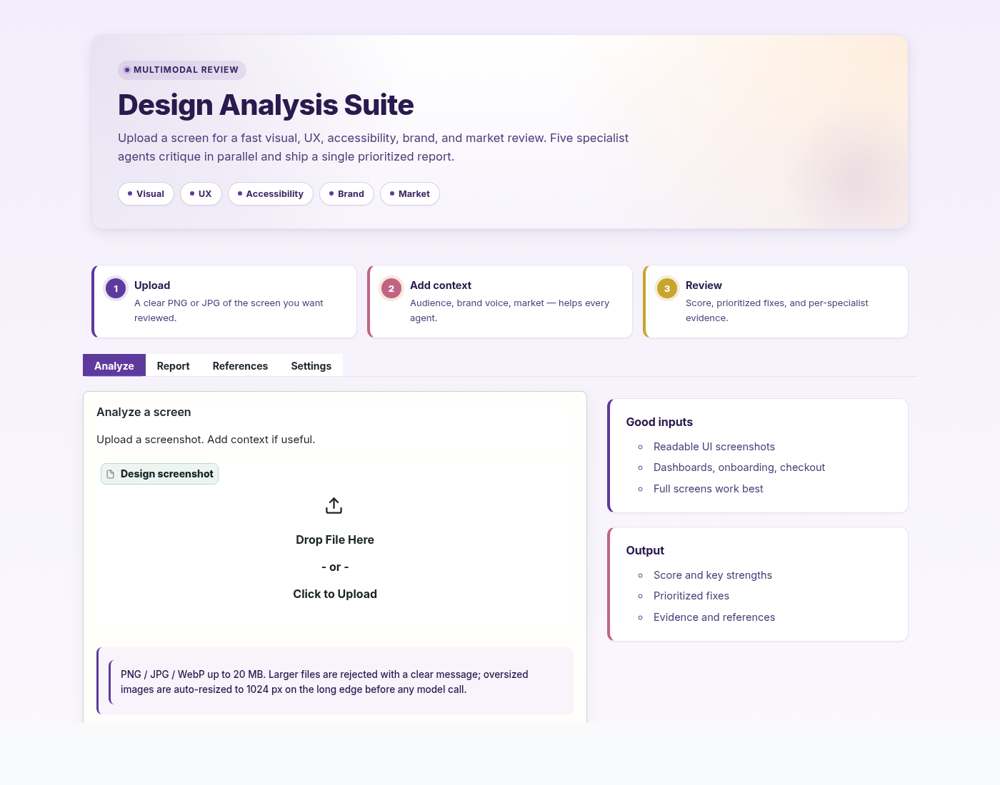
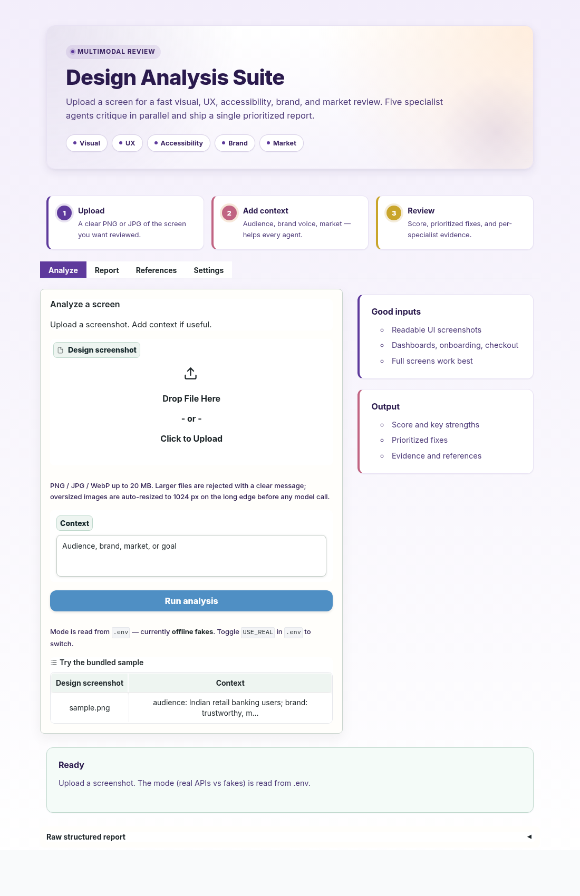
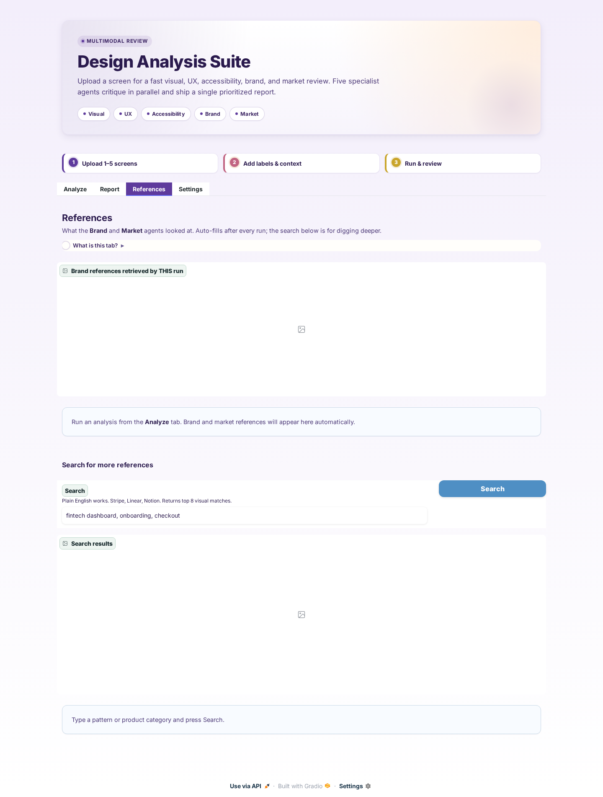
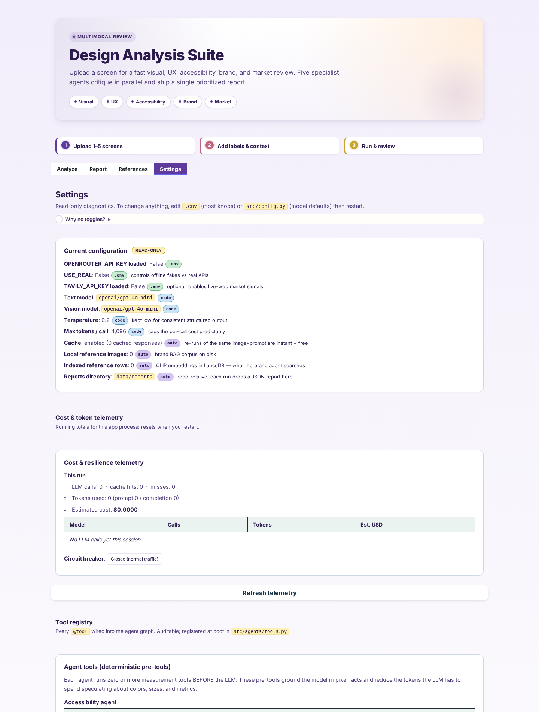
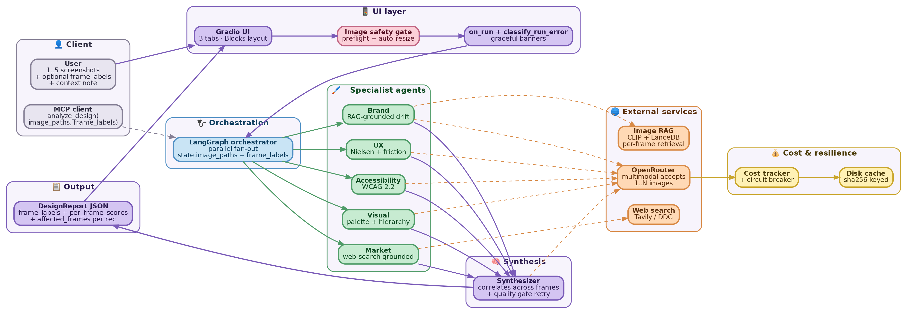
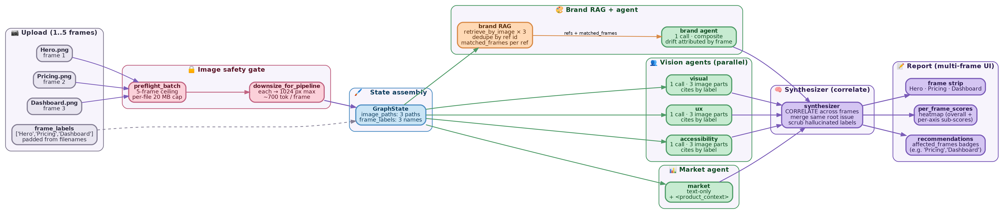
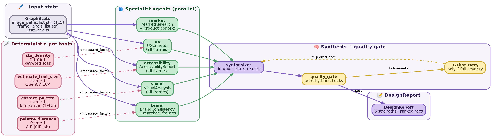
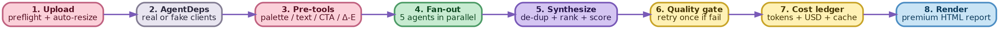
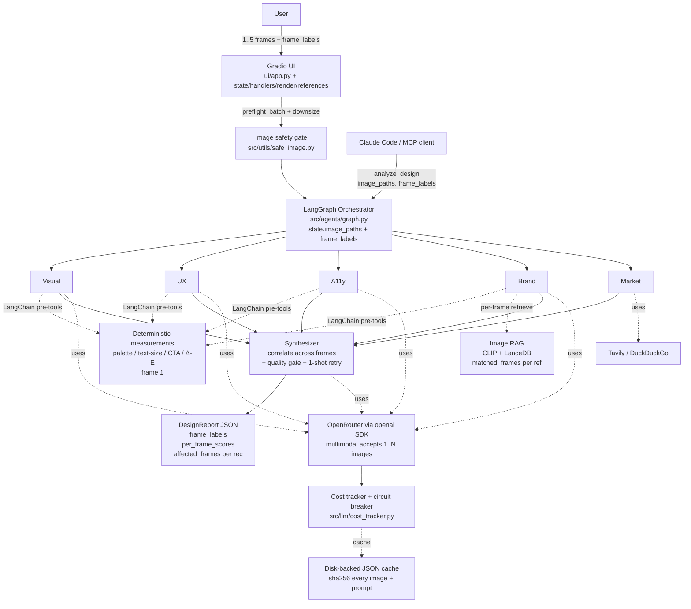

# Multimodal AI Design Analysis Suite

> A multi-agent LangGraph system that reviews uploaded UI/product designs.
> Five specialists run in parallel — visual, UX, accessibility, brand, and
> market — over an image-RAG corpus. The synthesizer aggregates everything
> into a typed `DesignReport`. Built for the C7 Engineering Accelerator
> hackathon.

## What it does

1. Drag **1 to 5 design screenshots** into the Gradio UI (or call
   `analyze_design` over MCP from Claude Code or any other
   MCP-compatible client). Multiple frames of the same product are
   treated as ONE coherent product.
2. **Five specialist agents** fan out concurrently. Each vision agent
   sees every uploaded frame in one call; the brand-RAG queries each
   frame and dedupes; market is text-only but reads frame labels so its
   competitor / trend selection is anchored on the full product surface.
3. The synthesizer **correlates findings across frames**, names the
   affected frames in every recommendation (`affected_frames`), and
   emits a per-frame heatmap of scores. Output is one typed
   `DesignReport` — top-3 strengths, top-5 prioritized recs, overall
   score, per-axis breakdown, and (when N>1) per-frame sub-scores.

### Sample prioritized recommendations from a multi-frame run

```
[1] Replace the secondary-CTA grey for primary actions
    affected: Pricing, Checkout
    impact: H · effort: M · proof: visual:contrast_2.8_to_1
    metric_lift: +6-9% conversion (industry benchmark for primary-CTA contrast lift)

[2] Tighten typography rhythm to a single 1.25 modular scale
    affected: Hero, Pricing
    impact: M · effort: S · proof: visual:type_drift

[3] Add focus-visible outline to all interactive elements
    affected: Hero, Pricing, Dashboard
    impact: H · effort: S · proof: a11y:wcag_2.4.7
```

## What the UI looks like

The lead screenshot — Analyze tab with the **Do upload / Don't upload /
What you'll get** disclosure expanded. The form itself is intentionally
quiet: every field has a hover-tooltip (`i`) for the *why* and the long
copy lives behind one click instead of cluttering the panel.



### Tab tour

<table width="100%">
<tr>
  <td width="50%" valign="top">
    <a href="docs/images/ui_analyze.png">
      
    </a>
    <p><b>Analyze</b> — drop 1-5 screenshots of the same product, optional frame labels (rename your files first and skip this — the filename becomes the label), one-line context. Press Run.</p>
  </td>
  <td width="50%" valign="top">
    <a href="docs/images/ui_references.png">
      
    </a>
    <p><b>References</b> — what the <b>Brand</b> and <b>Market</b> agents looked at this run. Auto-fills after every Run. Search panel below for digging deeper across the local CLIP index and the live web.</p>
  </td>
</tr>
<tr>
  <td width="50%" valign="top">
    <a href="docs/images/ui_settings.png">
      
    </a>
    <p><b>Settings</b> — read-only diagnostics. Every value carries one of three source badges: <code>.env</code> (edit + restart), <code>code</code> (<code>src/config.py</code>), or <code>auto</code> (computed from disk). Cost &amp; circuit-breaker telemetry, plus the @tool registry below.</p>
  </td>
  <td width="50%" valign="top">
    <a href="docs/images/architecture.png">
      
    </a>
    <p><b>Architecture</b> — top-level system map. Five specialist agents fan out from one LangGraph orchestrator; the synthesizer collapses their output into a single typed <code>DesignReport</code>. Re-render with <code>make diagrams</code>.</p>
  </td>
</tr>
</table>

### What each tab does

| Tab | What it shows | Multi-frame additions |
| --- | --- | --- |
| **Analyze** | Drop 1-5 screenshots, name the frames, type context, click Run | Multi-file upload widget; optional `frame_labels` textbox; status banner names each frame as it streams through |
| **Report** | Premium HTML rendering of the typed `DesignReport` — overall score, ranked recs, strengths, per-axis breakdown | Labeled **frame strip** at the top, **per-frame heatmap** of scores, `affected_frames` badges next to every recommendation title |
| **References** | Brand-RAG hits the agents looked at, plus market-agent URLs, plus ad-hoc local + web search | Each gallery item carries `matched · Hero, Pricing` so you can see which screen surfaced each ref |
| **Settings** | Read-only diagnostics — model + temperature, USE_REAL flag, tools registry, cost ledger, cache + circuit-breaker state | Cost ledger amortises across all frames in the current run |

## Architecture

The diagrams below are rendered from `scripts/render_diagrams.py`
(graphviz, no proprietary dependencies). Every PASTEL fill / text pair
clears WCAG AAA so the figures stay legible in print, on a projector,
and in dark-mode README previews. Re-render anytime with:

```bash
python scripts/render_diagrams.py    # writes 4 PNGs to docs/images/
make diagrams                        # equivalent shortcut
```

### Top-level — user → UI → graph → agents → report

This is the architecture map. Five specialist agents fan out from one
LangGraph orchestrator; the synthesizer collapses their output into a
single `DesignReport` and the UI renders the multi-frame strip,
heatmap, and `affected_frames` badges.


### Multi-frame comparison mode — what happens to your N screenshots

The new diagram (Hero, Pricing, Dashboard upload → per-frame heatmap
out) shows the lifecycle of a multi-frame run end-to-end. Brand RAG
queries every frame and dedupes; the synthesizer correlates findings
across screens; the report attributes each recommendation to the
specific frame(s) it affects.



### Agent fan-out detail — pre-tools, parallel branches, quality gate



### One click of "Run" — nine ordered steps



A single mermaid version of the same flow (handy for GitHub PR previews
that don't render PNGs):



The full diagram set lives in `docs/ARCHITECTURE.md` and the interactive
walkthrough in `docs/walkthrough.html`.

### What is in the diagram that is not in the curriculum

Seven robustness pillars wrap the multi-agent core. They are what turns
this from a class project into something close to a product:

1. **Image safety gate** (`src/utils/safe_image.py`) — preflight every
   upload (suffix allowlist, 20 MB cap, 4 MP cap), then auto-resize to
   1024 px before the pipeline ever sees the file.
2. **LangChain `@tool` pre-tools** (`src/agents/tools.py`) — k-means
   palette in CIELab, OpenCV text-size, CTA-density heuristic, Δ-E
   palette distance. Run BEFORE the LLM, ground the prompt in measured
   facts, save tokens.
3. **Anti-hallucination prompt scaffolding** (`src/utils/prompts/`) —
   every system prompt carries an `ANTI_HALLUCINATION_RULE` and an
   `ABSTENTION_RULE`. Prompts are pinned by regression tests.
4. **Cost tracker + circuit breaker** (`src/llm/cost_tracker.py`) —
   per-run telemetry visible in Settings; fast-fail after 2 hard
   failures so a typo'd API key cannot burn 25 doomed network calls.
5. **Quality gate + 1-shot synthesizer retry** (`src/agents/quality_gate.py`)
   — pure-Python content checks; if a `fail`-severity issue is found
   in the first synthesizer output, ONE corrective re-prompt is sent.
6. **Visual-agent self-heal** (`src/agents/visual_analysis.py`) —
   `gpt-4o-mini` rejects strict `json_schema` mode about 95 % of the
   time on multi-image runs and falls through to plain `json_object`,
   which often returns a palette-only payload. The agent detects that
   shallow shape and re-prompts ONCE with a corrective directive
   ("you forgot layout / hierarchy / typography — re-emit"). Cost
   doubles only on the broken case; clean runs pay nothing extra.
7. **Persistent on-disk app log** (`src/utils/logger.py`) — every log
   line is tee'd to `data/logs/app.log` with 10 MB rotation (5 backups).
   Users no longer copy from a rolling console; the path is printed at
   launch and shown in the Settings tab. `LOG_TO_FILE=0` opts out.

All seven are implemented today. None of them ship as buzzwords; each
has a one-page section in `docs/ARCHITECTURE.md`.

## Quickstart

### 1. Install (one-time)

**Linux / macOS:**

```bash
git clone <this-repo-url> ai_c7_hackathon && cd ai_c7_hackathon
python3 -m venv .venv && source .venv/bin/activate
pip install -e ".[dev]" -r requirements/all.txt
make test                        # 56 tests, ~8 seconds — confirms the install
```

**Windows (PowerShell):**

```powershell
git clone <this-repo-url> ai_c7_hackathon ; cd ai_c7_hackathon
python -m venv .venv ; .venv\Scripts\Activate.ps1
pip install -e ".[dev]" -r requirements/all.txt
pytest -q                        # equivalent to `make test`
```

> `make` is not native on Windows. Either install it
> (`choco install make` recommended) and use the `make` targets, or run
> the underlying `python -m ...` commands directly. Every Makefile target
> is one line — open the `Makefile` to see the literal commands.

### 2. Launch the app — four equivalent commands

The Gradio app is the same in all four; pick whichever fits your workflow.

```bash
make ui                  # runs python ui/app.py — recommended on Linux/macOS
python ui/app.py         # direct execution — works on every OS
python -m ui.app         # module-style — handy when ui/ is on PYTHONPATH
python app.py            # the HF Spaces shim (a 4-line wrapper around ui.app:main)
```

All four open the UI on **<http://127.0.0.1:7860>**. The first launch can
take ~15 s while Gradio boots; subsequent launches are instant.

### 3. First-time analysis — what to upload

The Analyze tab takes **1 to 5 screenshots of the SAME product**
(PNG / JPG / WebP, up to 20 MB each; oversized files are auto-resized to
1024 px on the long edge before any model call). The output is one
prioritized `DesignReport`.

There are two flavours of run, both produced by the same pipeline:

- **Single-frame** — drop one screenshot for a fast review of one screen.
- **Multi-frame** *(comparison mode)* — drop 2 to 5 screenshots of the
  same site/app and the team treats them as **one coherent product**.
  Every vision specialist sees all frames in a single call; the
  synthesizer correlates findings across screens, names the affected
  frames in every recommendation (`affected_frames`), and emits a
  per-frame heatmap so you can see which screen is the weak link.

> **Frame labels** — when uploading multiple frames, the optional
> "Frame labels" textbox lets you name each screen ("Hero", "Pricing",
> "Dashboard"). With labels the report says *"Pricing has the contrast
> issue"*; without, you get *"frame 2 has the contrast issue"*. Pro tip:
> rename your files BEFORE uploading and the filename becomes the label
> automatically.

> **Why a 5-frame cap?** Each frame is one image charge to the vision
> LLM (≈$0.008 on the default `gpt-5-mini`). Five frames is the sweet spot for a
> full product surface (Landing → Signup → Dashboard → Settings →
> Checkout) without runaway tokens. For batch review across many
> independent designs, see [`scripts/run_evals.py`](scripts/run_evals.py).

### 4. Multiple reference images — the brand-RAG corpus

The brand-consistency agent is the only specialist that needs multiple
images, and they go into the **reference corpus** (NOT the Analyze upload).
You build the corpus once, then every "Run" retrieves the closest matches
against the single uploaded screenshot.

```bash
# 1. Drop ANY number of reference designs into data/reference/
cp my_brand_screens/*.png data/reference/

# 2. Index them — CLIP embeddings are written to LanceDB
make ingest                                          # = python -m scripts.ingest_references --source ./data/reference

# 3. Confirm the count from the Settings tab — "Local reference images"
#    and "Indexed reference rows" should both reflect the new total.
```

The bundled corpus is empty by default; tests use the in-memory `FakeRetriever`.
For a serious demo, ingest 10–30 reference screens.

### 5. Switch on real APIs

1. **Get an OpenRouter key** at <https://openrouter.ai/keys> (sign in → "Create
   Key"). Add $5 of credits — that lasts the entire hackathon.
2. (Optional) **Tavily** at <https://app.tavily.com/home> for nicer
   market-research snippets — 1,000 queries/month free. Skip it and the code
   falls back to DuckDuckGo automatically.
3. (Optional) **LangSmith** at <https://smith.langchain.com/settings> →
   "API Keys" for traces — 5,000 traces/month free.

**Copy the env template** (Linux/macOS: `cp .env.example .env`;
Windows: `Copy-Item .env.example .env`) and edit at minimum:

```
OPENROUTER_API_KEY=sk-or-v1-...
TAVILY_API_KEY=tvly-...                        # optional
LANGCHAIN_API_KEY=lsv2_pt_...                  # optional
LANGCHAIN_TRACING_V2=true                      # optional
USE_REAL=1                                     # flip 0 → 1
```

**Verify the key loaded** (works on every OS):

```bash
python -c "from src.config import settings; print('OR key set:', bool(settings.openrouter_api_key))"
# Expect:  OR key set: True
```

Then re-launch the app with the same command from step 2. The Settings tab
will now show **`Real API key loaded: True`** and **`USE_REAL in .env: True`**.

Per-slice setup (just *your* keys, just *your* deps) is in
`docs/PERSON_<A|B|C|D|E>.md` — each starts with a "Setup — first 5 minutes"
block listing exactly which keys you personally need and which you can skip.

## Per-person quickstart

| Person | Slice | Install | Smoke run |
|---|---|---|---|
| A | Infra & orchestration | `make install-a` | `make run-a` |
| B | Image RAG | `make install-b` | `make ingest && make run-b` |
| C | Visual + Brand agents | `make install-c` | `make run-c-visual && make run-c-brand` |
| D | UX + Accessibility agents | `make install-d` | `make run-d-ux && make run-d-a11y` |
| E | Market + UI + MCP | `make install-e` | `make ui` and `make mcp` |

Per-person READMEs in `docs/PERSON_*.md` explain the mission, contracts,
hot-spots, and "done when" checklist for each slice.

## Repo layout

```
app.py                       Hugging Face Spaces entry point — imports ui.app:main
requirements.txt             HF Spaces dependency manifest

src/
  config.py                  settings (pydantic-settings)
  contracts.py               Protocol classes — the seams between people
  schemas/outputs.py         every cross-module Pydantic model
  fakes/                     deterministic doubles for offline development
  llm/
    openrouter_client.py     real LLMClient over OpenRouter
    multimodal.py            vision message builder + encoder
    cost.py                  disk-backed JSON cache + @cached decorator
    cost_tracker.py          process-wide cost telemetry + circuit breaker
    hf_local.py              Sprint 2 HF concept stub
  rag/
    embedder.py              CLIP image+text embedder
    vector_store.py          LanceDB schema + open/get_or_create
    retriever.py             retrieve_by_image / retrieve_by_text
    editorial_refs.py        hand-curated fallback when RAG + web are empty
  tools/
    web_search.py            Tavily / DuckDuckGo provider
    image_utils.py           side_by_side composite (saves tokens)
    rag_tool.py              LangChain BaseTool wrapper around Retriever
  agents/
    base.py                  AgentDeps + run_with_schema helper
    {visual_analysis,ux_critique,accessibility,brand_consistency,market_research}.py
    synthesizer.py           fan-in node + quality-gate retry loop
    graph.py                 LangGraph wiring + plain-Python fallback
    tools.py                 LangChain @tool pre-tools (palette, text size, CTA, Δ-E)
                             + basic tools (read_file, list_files, web_search)
    quality_gate.py          pure-Python content checks for DesignReport
    _color_math.py           CIELab / k-means / hex helpers (used by tools)
  utils/
    logger.py                loguru-based logger
    tracing.py               LangSmith init + traced(...) context manager
    safe_image.py            preflight + downsize for every upload
    prompts/                 prompt PACKAGE: one file per agent
      _shared.py             JSON / EVIDENCE / ANTI_HALLUCINATION /
                             ABSTENTION / SELF_CHECK / TONE rules
      visual.py / ux.py / market.py / accessibility.py /
      brand.py / synthesizer.py
  evals/                     schema-validity harness
  mcp/server.py              stdio MCP server (analyze_design, search_designs)

ui/
  app.py                     Gradio Blocks — entry point + main()
  state.py                   settings refresh + status / settings cards
  handlers.py                on_run + classify_run_error (graceful errors)
  render.py                  premium DesignReport HTML rendering
  references.py              References-tab payload + ad-hoc search
  styles.py                  loads APP_CSS + light-theme JS / HEAD HTML
  static/app.css             actual CSS (1.3k lines, real .css file)

scripts/                     ingest_references, run_evals
tests/
  conftest.py                shared fixtures
  test_{schemas,contracts,fakes,prompts,tools,safe_image,quality_gate,
        editorial_refs}.py   cross-cutting (everyone runs)
  person_a..e/               per-slice tests
docs/
  PERSON_*.md                per-person READMEs
  ARCHITECTURE.md, DEMO_SCRIPT.md, CONCEPT_COVERAGE.md
  COST_DISCIPLINE.md, DEPLOY_HF.md, FAQ.md
  walkthrough.html           self-contained interactive flow demo
```

## Concept coverage

See `docs/CONCEPT_COVERAGE.md` for the full mapping of accelerator concepts
to file paths. Every Sprint 1-6 has a real artifact the judges can point at.

## FAQ — design choices, deployment, debug

`docs/FAQ.md` answers the recurring questions:

- Why `temperature=0.2` (not the chat default 0.7)?
- How are images passed to the LLM (data URLs, no OCR)?
- Is this a "model council" like Perplexity? (No — panel of experts.)
- Will it run on Hugging Face Spaces / Vercel? (Yes / no.)
- Is everything open-source? (Libraries yes; OpenRouter is paid SaaS but
  every paid service has a working free fallback wired in.)
- Will errors be visible when I run? (Yes — every agent boundary logs.)
- Why is there an MCP server? (Sprint 4, plus the demo magic moment —
  any MCP-compatible coding agent can call our graph as a native tool.)

## Deploy

| Target | Verdict | Notes |
|---|---|---|
| Hugging Face Spaces (Gradio SDK) | **Recommended** — see `docs/DEPLOY_HF.md` | Free CPU tier; YAML metadata at the top of this README is HF-ready |
| Render / Fly.io | Works fine | Long-running container + persistent disk |
| Vercel | Not recommended | Serverless 60 s timeout, no persistent disk; would require rewriting Gradio as Next.js |
| Local laptop | Hackathon demo target | Zero cost |

Cost-conscious budget for one full demo run with real APIs at the
default `openai/gpt-5-mini` model ($0.25 / $2.00 per 1M tokens):

| Frames per run | Approx. cost | Notes |
|---|---|---|
| 1 (single-frame) | **≈ $0.006** | 4 vision calls × 1 image + synthesizer |
| 3 (typical multi-frame) | **≈ $0.017** | 4 vision calls × 3 images + synthesizer |
| 5 (max multi-frame) | **≈ $0.030** | hard ceiling enforced by the upload preflight |

Want it cheaper? Set `DEFAULT_VISION_MODEL=openai/gpt-5-nano` in `.env`
($0.05 / $0.40 per 1M tokens, ~5× cheaper, weaker reasoning so the
visual self-heal retry fires more often).

Cache turns repeats into free runs (cache key = sha256 of every image
byte + prompt + schema). Full breakdown in `docs/COST_DISCIPLINE.md`.

## What we did NOT build (honest list)

- Production-scale orchestration (Celery / Temporal). Replaced by in-process
  LangGraph plus a documented swap.
- Distributed Redis cache. Replaced by a disk-backed JSON cache.
- Multi-tenant LanceDB / per-tenant API keys. Single tenant for v1.
- HTTP MCP transport. stdio only.
- LLM-as-judge in evals. Schema-validity only — accurate enough for judging.
- Streaming token-by-token UI. Status updates per agent are emitted, the
  final report renders at end of run.
- Distributed tracing across services. LangSmith covers the LangGraph run.

The full "what we'd do for production" list is in
`docs/walkthrough.html` → **Scaling** tab.

## Tech stack

OpenRouter via `openai` SDK · LangGraph · LangChain-core (with `@tool`
decorator wiring) · LangSmith · LanceDB · open_clip_torch · LlamaIndex
(concept claim) · Pydantic v2 + pydantic-settings · Gradio · Tavily /
DuckDuckGo (auto fallback) · MCP Python SDK · OpenCV + Pillow + NumPy
(deterministic pre-tools) · pytest · ruff · black · mypy.

One library per concept — no duplicates.

## License & acknowledgements

MIT. Built by the C7 Hackathon Multimodal Group 1. Thanks to the Engineering
Accelerator Program for an excellent curriculum.
