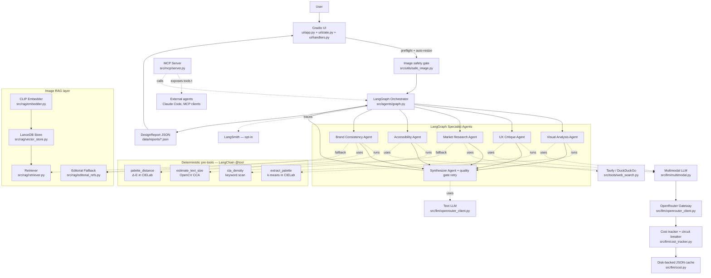
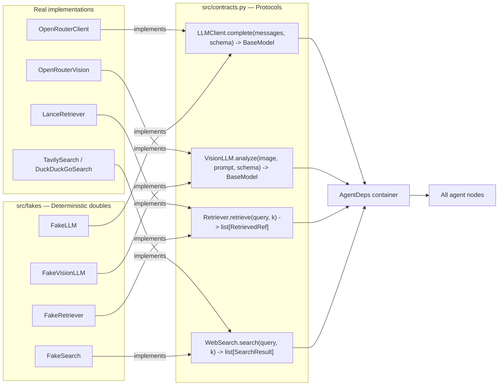

# Architecture

This is the single page the demo MC reads aloud. The interactive version is
`docs/walkthrough.html` — open it in any browser, no build step required.

## Rendered diagrams

Reproducible PNGs live in `docs/images/` and are regenerated by
`python scripts/render_diagrams.py` (graphviz `dot`, no proprietary deps).
Every PASTEL fill / text pair clears WCAG AAA so the figures stay
legible in print, on a projector, and in dark-mode previews.

| Diagram | What it answers |
| --- | --- |
|  | "What is in the system?" — UI, orchestrator, five specialists, synth, backends, resilience layer, output. |
|  | "What happens to my 3 screenshots?" — upload → preflight → state assembly → vision agents (every frame) → brand RAG (per frame) → synthesizer correlate → frame strip + heatmap + `affected_frames` badges. |
|  | "What runs in parallel?" — five branches, pre-tools per branch, synthesizer + quality-gate retry. |
|  | "What's the order of operations on one click of Run?" — nine sequential steps from upload to render. |

## Big picture



## The seven robustness layers (what wraps the multi-agent core)

These seven are NOT in the curriculum. They are what differentiates this
from a class project.

| Layer | File | What it does |
| --- | --- | --- |
| Image safety gate | `src/utils/safe_image.py` | preflight (suffix, size, resolution) + auto-resize to 1024 px before the pipeline ever sees the file |
| LangChain `@tool` pre-tools | `src/agents/tools.py` | k-means palette, OpenCV text-size, CTA-density, Δ-E palette distance — run BEFORE the LLM, ground its prompt |
| Anti-hallucination prompt scaffolding | `src/utils/prompts/_shared.py` | `ANTI_HALLUCINATION_RULE` + `ABSTENTION_RULE` templated into every system prompt; pinned by regression tests |
| Cost tracker + circuit breaker | `src/llm/cost_tracker.py` | per-run telemetry visible in Settings; fast-fail after 2 hard failures so a typo'd API key cannot burn 25 doomed calls |
| Quality gate + 1-shot synthesizer retry | `src/agents/quality_gate.py` | pure-Python content checks; if a `fail`-severity issue is found in the first synthesizer output, ONE corrective re-prompt is sent |
| Visual-agent self-heal on shallow response | `src/agents/visual_analysis.py` | when the vision model rejects strict `json_schema` and the fallback returns a palette-only payload (the gpt-4o-mini multi-image bug), the agent re-prompts ONCE with a corrective critique. Detection lives in `_is_shallow_visual`; one retry doubles visual cost only on broken runs |
| Persistent on-disk app log | `src/utils/logger.py` | every log line is tee'd to `data/logs/app.log` with 10 MB rotation (5 backups). Path is printed at launch and shown in Settings, so users tail a file instead of copying from the rolling console. `LOG_TO_FILE=0` opts out |

## Dependency injection seam



## Data flow on one click of "Run"

1. **UI** receives `image_paths` (1..5 PNG/JPG/WebP), optional
   `frame_labels`, and optional `instructions`. The handler runs every
   upload through `src.utils.safe_image.preflight_batch` (per-file
   validation + 5-frame cap) and `downsize_for_pipeline` (auto-resize
   to 1024 px on the long edge). Bad files are rejected with a clean
   banner; oversized files are silently shrunk so a 30 MB phone
   screenshot does not crash the run.
2. **`run_graph`** builds `AgentDeps` (real or fake), constructs
   `GraphState` with both `image_paths` and `frame_labels`, and resets
   the `CostTracker`. The state validator pads short label lists with
   filename stems so every frame has a name the synthesizer can cite.
3. **Per-agent pre-tools** run synchronously before the LLM call on the
   PRIMARY frame (`state.image_path`, the first of `image_paths`):
   `extract_palette` for visual, `estimate_text_size` for accessibility,
   `cta_density` for ux, `palette_distance` for brand. Their outputs are
   injected as `<measured_facts>` so the model never has to invent them.
   Multi-frame runs apply the pre-tool measurements globally; if drift
   across frames matters, the LLM sees it directly because every vision
   agent receives ALL frames in the same call.
4. **Fan-out from `START`**: `visual`, `ux`, `accessibility`, `brand`,
   `market` execute concurrently via LangGraph's `asyncio.gather`
   scheduler. The four vision agents each receive every uploaded frame
   in one multi-image call (encoded as separate `image_url` content
   parts); `market` is text-only but reads `state.frame_labels` so its
   competitor / trend selection is anchored on the full product surface.
5. **Brand RAG (multi-frame)**: `_retrieve_for_all_frames` queries the
   CLIP retriever once per frame and merges results, deduping by ref
   id and keeping the highest score. Each kept ref carries
   `matched_frames` — the labels whose query surfaced it — so the
   prompt and the References tab can attribute drift to specific
   screens ("Pricing matched stripe-pricing-2024 at 0.83").
6. **Synthesizer** consumes the merged state, sees the frame labels in
   `<multi_frame_synthesis>`, and is contractually required to populate
   `affected_frames` on every recommendation and `per_frame_scores`
   keyed by exact frame label. The output is scrubbed server-side
   against the canonical label set so a hallucinated label cannot leak
   into the report. The quality gate flags missing per-frame scores as
   a `warn` so the corrective re-prompt loop catches it.
7. **Persistence**: report JSON saved to `data/reports/<ts>-<stem>.json`;
   cost ledger snapshotted for the Settings tab.
8. **UI** renders the premium report (Report tab) — including the
   labelled frame strip, the per-frame heatmap, and `affected_frames`
   badges on every recommendation — plus the References tab (with
   `matched_frames` pinned on each gallery item) and the Settings
   read-only diagnostics. Any unexpected exception is converted to a
   friendly banner via `ui.handlers._classify_run_error` — the user
   never sees a Python traceback.

## UI module split

```
ui/
  app.py          # entry point + Blocks layout + main()
  strings.py     # all static guide-card / tip / placeholder HTML strings
                  # + the runtime-config card builder; keeps app.py wiring-
                  # focused so the 500 LOC budget covers callbacks, not text
                  # (named "strings" not "copy" to avoid shadowing stdlib copy
                  # when running ``python ui/app.py``)
  state.py       # settings refresh, status / settings cards, telemetry
  handlers.py    # on_run (multi-frame aware) + classify_run_error
  render.py      # premium DesignReport HTML rendering — frame strip,
                  # per-frame heatmap, affected_frames badges
  references.py  # References-tab payload + ad-hoc search handler
                  # (surfaces matched_frames on each gallery item)
  styles.py      # loads APP_CSS + light-theme JS / HEAD HTML
  static/app.css # actual CSS (real .css file, not Python string)
```

The split exists to keep every Python file under 500 LOC. `python -m
ui.app` and the HF Spaces `app.py` shim both still resolve to the same
entry point. `ui/copy.py` was extracted specifically so a non-engineer
(designer, PM) can tweak helper text without ever touching wiring code.

## Multi-frame contracts (the new fields)

Every multi-frame change lives behind explicit Pydantic fields on
`src/schemas/outputs.py` so older callers never break:

| Field | Where | Contract |
| --- | --- | --- |
| `GraphState.image_paths: list[str]` | every agent input | 1..5 paths; `image_path` is an alias to `[0]` for legacy single-image pre-tools |
| `GraphState.frame_labels: list[str]` | every agent input | parallel to `image_paths`; empty entries fall back to filename stems via the validator |
| `RetrievedRef.matched_frames: list[str]` | brand RAG output | which frame labels surfaced this ref (empty for single-frame) |
| `Recommendation.affected_frames: list[str]` | every recommendation | which frame labels the fix applies to (empty = global / single-frame) |
| `DesignReport.frame_labels: list[str]` | top-level report | canonical ordered label list — UI uses this for the strip and heatmap |
| `DesignReport.per_frame_scores: dict[str, dict[str, float]]` | top-level report | per-label per-axis sub-scores (clamped 0-100); empty for single-frame |

The synthesizer is the ONLY place that populates `affected_frames` and
`per_frame_scores`; the orchestrator scrubs both against the canonical
`frame_labels` set so a hallucinated label can never reach the UI.

## Extension points (post-MVP)

- **Hybrid retrieval** — combine CLIP image vectors with text-keyword filter.
- **LLM-as-judge in evals** — replace `schema_valid` with a rubric score.
- **Tier selection** — `cost.select_model` becomes a real router that picks
  cheaper models for narrow tasks and bigger ones for brand consistency.
- **Multi-tenant LanceDB** — add `tenant_id` to the schema.
- **Async MCP transport** — swap stdio for HTTP behind a reverse proxy.
- **Tile mode for huge screenshots** — split a 6 K x 4 K capture into
  quadrants, run the visual agent on each, then a final pass to reason
  across tiles. Already designed; one config switch and a Python loop.
