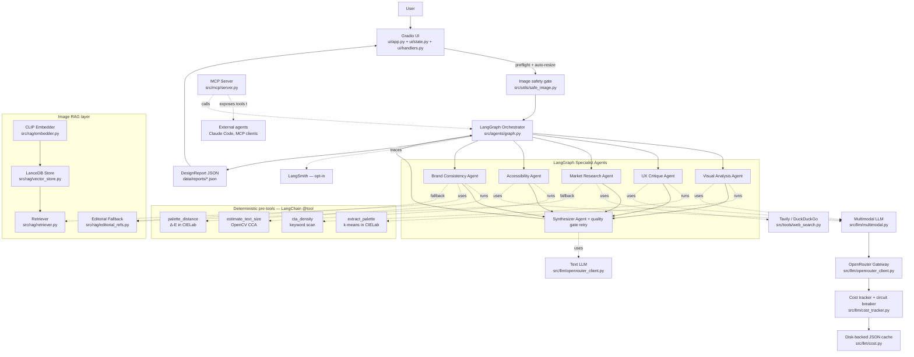
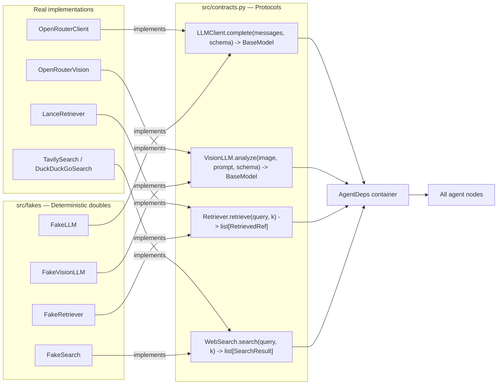

# Architecture

This is the single page the demo MC reads aloud. The interactive version is
`docs/walkthrough.html` — open it in any browser, no build step required.

## Big picture



## The five robustness layers (what wraps the multi-agent core)

These five are NOT in the curriculum. They are what differentiates this
from a class project.

| Layer | File | What it does |
| --- | --- | --- |
| Image safety gate | `src/utils/safe_image.py` | preflight (suffix, size, resolution) + auto-resize to 1024 px before the pipeline ever sees the file |
| LangChain `@tool` pre-tools | `src/agents/tools.py` | k-means palette, OpenCV text-size, CTA-density, Δ-E palette distance — run BEFORE the LLM, ground its prompt |
| Anti-hallucination prompt scaffolding | `src/utils/prompts/_shared.py` | `ANTI_HALLUCINATION_RULE` + `ABSTENTION_RULE` templated into every system prompt; pinned by regression tests |
| Cost tracker + circuit breaker | `src/llm/cost_tracker.py` | per-run telemetry visible in Settings; fast-fail after 2 hard failures so a typo'd API key cannot burn 25 doomed calls |
| Quality gate + 1-shot synthesizer retry | `src/agents/quality_gate.py` | pure-Python content checks; if a `fail`-severity issue is found in the first synthesizer output, ONE corrective re-prompt is sent |

## Dependency injection seam



## Data flow on one click of "Run"

1. **UI** receives `image_path` + `instructions` and validates the upload
   via `src.utils.safe_image.preflight_image`. Bad files are rejected with
   a clean banner; oversized images are auto-resized to 1024 px.
2. **`run_graph`** builds `AgentDeps` (real or fake), constructs `GraphState`,
   and resets the `CostTracker`.
3. **Per-agent pre-tools** run synchronously before the LLM call:
   `extract_palette` for visual, `estimate_text_size` for accessibility,
   `cta_density` for ux, `palette_distance` for brand. Their outputs are
   injected into the user prompt as `<measured_facts>` so the model never
   has to invent them.
4. **Fan-out from `START`**: `visual`, `ux`, `accessibility`, `brand`,
   `market` execute concurrently via LangGraph's `asyncio.gather` scheduler.
   Each returns a partial-state dict — no write conflicts.
5. **Synthesizer** consumes the merged state, calls the LLM with
   `schema=DesignReport`, and runs the quality gate. If a `fail`-severity
   issue is found in the first output, a single corrective re-prompt is
   sent with the failure list.
6. **Persistence**: report JSON saved to `data/reports/<ts>-<stem>.json`;
   cost ledger snapshotted for the Settings tab.
7. **UI** renders the premium report (Tab 1), the references the agents
   actually consulted (Tab 2), and the cost / tools telemetry (Tab 3).
   Any unexpected exception is converted to a friendly banner via
   `ui.handlers._classify_run_error` — the user never sees a Python
   traceback.

## UI module split

```
ui/
  app.py          # entry point + Blocks layout + main()
  state.py       # settings refresh, status / settings cards, telemetry
  handlers.py    # on_run + classify_run_error (graceful errors)
  render.py      # premium DesignReport HTML rendering
  references.py  # References-tab payload + ad-hoc search handler
  styles.py      # loads APP_CSS + light-theme JS / HEAD HTML
  static/app.css # actual CSS (real .css file, not Python string)
```

The split exists to keep every Python file under 500 LOC. `python -m
ui.app` and the HF Spaces `app.py` shim both still resolve to the same
entry point.

## Extension points (post-MVP)

- **Hybrid retrieval** — combine CLIP image vectors with text-keyword filter.
- **LLM-as-judge in evals** — replace `schema_valid` with a rubric score.
- **Tier selection** — `cost.select_model` becomes a real router that picks
  cheaper models for narrow tasks and bigger ones for brand consistency.
- **Multi-tenant LanceDB** — add `tenant_id` to the schema.
- **Async MCP transport** — swap stdio for HTTP behind a reverse proxy.
- **Tile mode for huge screenshots** — split a 6 K x 4 K capture into
  quadrants, run the visual agent on each, then a final pass to reason
  across tiles. Already designed; one config switch and a Python loop.
