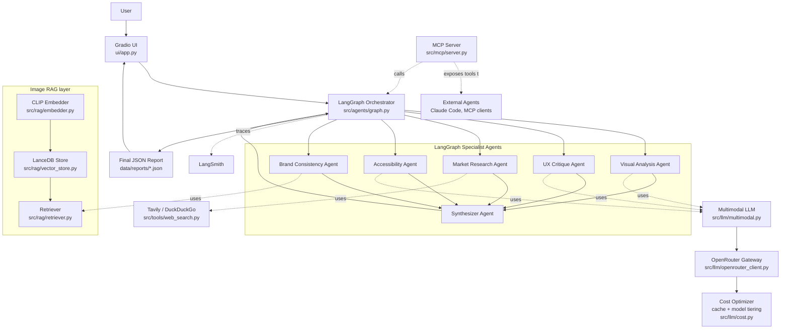
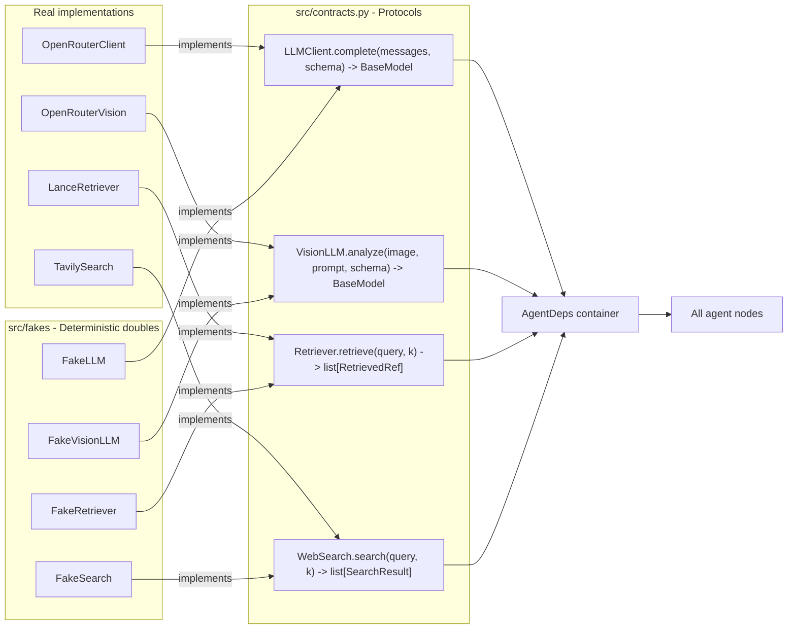

# Architecture

This is the single page the demo MC reads aloud. The interactive version is
`docs/walkthrough.html` — open it in any browser, no build step required.

## Big picture

## Dependency injection seam

## Data flow on one click of "Run"

1. **UI** receives `image_path` + `instructions`.
2. **`run_graph`** builds `AgentDeps` (real or fake), constructs `GraphState`.
3. **Fan-out from `START`**: `visual`, `ux`, `accessibility`, `brand`, `market`
   all execute concurrently via LangGraph's `asyncio.gather` scheduler.
   Each returns a partial-state dict — no write conflicts.
4. **Synthesizer** consumes the merged state, calls the LLM with
   `schema=DesignReport`, persists the JSON to `data/reports/<ts>-<stem>.json`.
5. **UI** renders the report (Tab 2) with the retrieved references gallery
   (Tab 3 of the same run).

## Extension points (post-MVP)

- **Hybrid retrieval** — combine CLIP image vectors with text-keyword filter.
- **LLM-as-judge in evals** — replace `schema_valid` with a rubric score.
- **Tier selection** — `cost.select_model` becomes a real router that picks
  cheaper models for narrow tasks (e.g. accessibility) and bigger ones for
  brand consistency.
- **Multi-tenant LanceDB** — add `tenant_id` to the schema.
- **Async MCP transport** — swap stdio for HTTP behind a reverse proxy.
