## Goal

A clean, modular skeleton with hints/comments, TODOs, and per-function descriptions so a 5-person team can each own a slice and ship a Multimodal AI Design Analysis Suite during the C7 hackathon.

Hackathon scoring targets:
- **Concept Score (10/10)** by hitting Sprints 1-6
- **Difficulty (10/10)** via image RAG + LangGraph multi-agent + evals + MCP
- **Code Quality (10/10)** via pyproject + Pydantic types + ruff/black/mypy + pytest + modular layout

## Container-per-person principle

Every teammate must be able to clone, install, set 1-2 env vars, and run their slice end-to-end without depending on any other person's actual implementation. We achieve that with three pieces:

1. **Interface contracts** (`src/contracts.py`) - `Protocol` classes that define the seams: `LLMClient`, `VisionLLM`, `Retriever`, `WebSearch`. Every consumer codes against the protocol, never the concrete class.
2. **Fakes layer** (`src/fakes/`) - deterministic, schema-valid fake implementations of every contract. No network, no keys, no GPU.
3. **Per-slice CLI runners** - every agent/module exposes a `python -m ...` entry point that builds an `AgentDeps` container with fakes by default. Set `USE_REAL=1` to swap in real implementations for that one slice.

Result: Person C can finish the Visual Analysis agent against a `FakeRetriever` while Person B is still wiring LanceDB, and the agent will keep working unchanged when the real retriever lands.

## Repo-wide coding standards

Everyone writes the same shape of code so review is fast.

### File header template (every `*.py`)

```python
"""
<one-line purpose>

OWNER: Person <X>
SPRINT CONCEPTS: <e.g. "Sprint 5 - LangGraph, LangChain tools">
CONSUMES: <protocols this file uses, e.g. LLMClient, Retriever>
PROVIDES: <classes/functions this file exports>

LOGIC OUTLINE
-------------
1. <step 1>
2. <step 2>
3. <step 3>

HINTS
-----
- <gotcha 1>
- <gotcha 2>
"""
```

### Comment markers (case-sensitive, grep-friendly)

- `# TODO(<person>):` - work that still needs to happen.
- `# HINT:` - design hint or tip for the implementer; left in the file.
- `# LOGIC:` - explain a non-obvious branch, formula, or invariant.
- `# NOTE:` - context that helps future readers.
- `# FIXME:` - known wrong; must be fixed before merge.

Run `rg "^\s*# TODO|^\s*# FIXME" src/` before every demo to surface unfinished items.

### Function template

```python
def do_thing(arg: SomeType, *, opt: int = 5) -> ReturnType:
    """One-line summary in imperative mood.

    Args:
        arg: What it is and any constraints.
        opt: Default and meaning.

    Returns:
        What the caller gets back.

    Raises:
        SpecificError: When and why.
    """
    # LOGIC: one sentence on what this function actually does.
    ...
```

### Hard rules

- Type hints on every public function and method (mypy-clean).
- No bare `except`; catch the narrow type and re-raise or log.
- No `print` in `src/`; use `from src.utils import get_logger`.
- No reading `os.environ` outside `src/config.py`.
- Imports are sorted (ruff `I`); standard lib, third-party, local in three blocks.
- Public names only in `__init__.py`; underscore-prefix everything internal.
- One class or one function per concept per file; no god modules.

## Shared virtual environment and editable install

Single `.venv` at the repo root, used by all five teammates. The package is installed editable so any cross-module import "just works".

### Bootstrap (every teammate, once)

```bash
git clone <repo> && cd ai_c7_hackathon
python -m venv .venv
source .venv/bin/activate            # Windows: .venv\Scripts\activate
pip install -U pip wheel

# Install editable + your slice + dev tools
pip install -e ".[dev]"
pip install -r requirements/person-<x>.txt   # one of a/b/c/d/e

cp .env.example .env                 # set keys you have, leave others empty
```

After this, every file under `src/` is importable from anywhere as `from src.<module> import ...`. No `PYTHONPATH` hacks, no relative-import gymnastics, no copy-paste of code between teammates.

### What `pip install -e .` buys us

- `src/` is on `sys.path` for everyone, in every Python entry point (CLI, pytest, Gradio, MCP).
- A change Person B makes in `src/rag/retriever.py` is immediately visible to Person C's brand-consistency agent on the next run - no reinstall.
- All entry points are reachable through `python -m ...` and the `make` targets - no console-script packaging.

### `pyproject.toml` additions (Person A lands these)

```toml
[project.optional-dependencies]
dev = ["pytest", "pytest-cov", "ruff", "black", "mypy", "ipykernel"]
```

### Why one venv beats per-person venvs

- Same Python, same resolver state - no "works on my machine".
- One `.env` file, loaded once via `pydantic-settings`.
- Hot-edits propagate to everyone instantly because of `-e .`.
- One `pytest` invocation can run any subset of the suite.
- One `langsmith` project so traces from all five people land in the same dashboard.

### Common pitfalls and the fix

- **"`from src.contracts import ...` ImportError"** -> you forgot `pip install -e .` after activating the venv.
- **"my IDE flags imports as missing"** -> point the IDE Python interpreter at `.venv/bin/python`.
- **"my torch is CPU and Person B needs GPU"** -> agree up front; CPU is the default, GPU is opt-in via a separate `requirements/person-b-rag-gpu.txt`.
- **"two people changed the lockfile"** -> we do not commit a lockfile during the hackathon; pin in `requirements/*.txt` only. Re-run `pip install -e ".[dev]" -r requirements/<your-slice>.txt` after a pull.

## Testing infrastructure (per-slice, common venv)

Every person can run only their slice's tests, or the whole suite, against fakes by default.

### Test layout

```
tests/
  conftest.py                # shared fixtures: fake_deps, sample_image, tmp_settings
  test_schemas.py            # Person A - schema validation contract
  test_contracts.py          # Person A - protocol runtime checks
  test_fakes.py              # Person A - fakes are schema-valid
  person_a/
    test_openrouter.py       # marked real_api - skipped without key
    test_cost.py
    test_synthesizer.py
    test_graph.py
  person_b/
    test_embedder.py
    test_vector_store.py
    test_retriever.py
    test_rag_tool.py
  person_c/
    test_visual_analysis.py
    test_brand_consistency.py
  person_d/
    test_ux_critique.py
    test_accessibility.py
  person_e/
    test_market_research.py
    test_web_search.py
    test_ui_smoke.py
    test_mcp_server.py
```

### Pytest configuration (lives in `pyproject.toml`)

```toml
[tool.pytest.ini_options]
addopts = "-ra -q --strict-markers"
testpaths = ["tests"]
markers = [
  "person_a: infra and orchestration",
  "person_b: image RAG",
  "person_c: visual and brand agents",
  "person_d: ux and accessibility agents",
  "person_e: market, UI, MCP",
  "real_api: requires a real API key (OPENROUTER_API_KEY or TAVILY_API_KEY)",
  "slow: takes more than 1 second",
]
```

### Rules every test file follows

- Default deps come from the `fake_deps` fixture in `tests/conftest.py`. No network, no keys, no GPU.
- Tests that hit a real API are decorated `@pytest.mark.real_api` and `@pytest.mark.skipif(not os.getenv("OPENROUTER_API_KEY"), reason="...")`.
- Use `pytest.mark.<person_x>` at the file level so anyone can run their slice.
- Assertions check schema validity first, content second.

### Make targets

- `make test` -> `pytest -m "not real_api"` (default - all slices, fakes only).
- `make test-a` ... `make test-e` -> `pytest tests/person_<x> tests/test_schemas.py tests/test_contracts.py tests/test_fakes.py -m "not real_api"`.
- `make test-real` -> `pytest -m real_api` (requires `.env`).
- `make cov` -> `pytest --cov=src --cov-report=term-missing -m "not real_api"`.
- `make cov-<x>` -> coverage limited to `src/<slice>` for one person.

### No pre-commit hook for v1

We use `make fmt` + `make lint` + `make test-<x>` manually before pushes. Pre-commit is documented as a post-MVP polish item; not in scope for the hackathon.

## Architecture

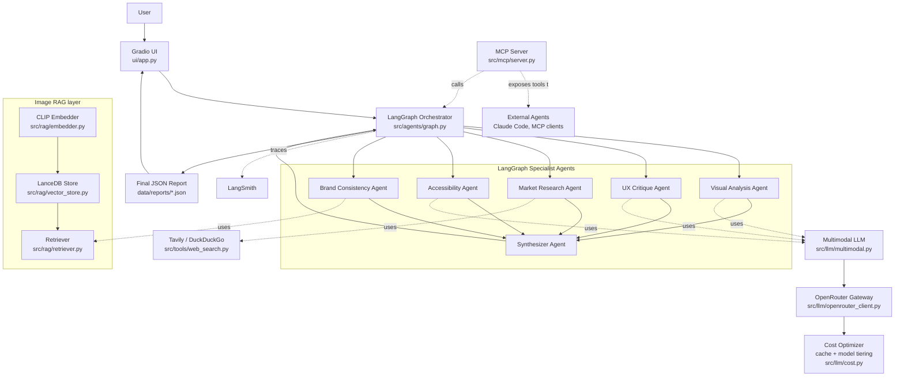

### Dependency injection seam (how the "containers" connect)

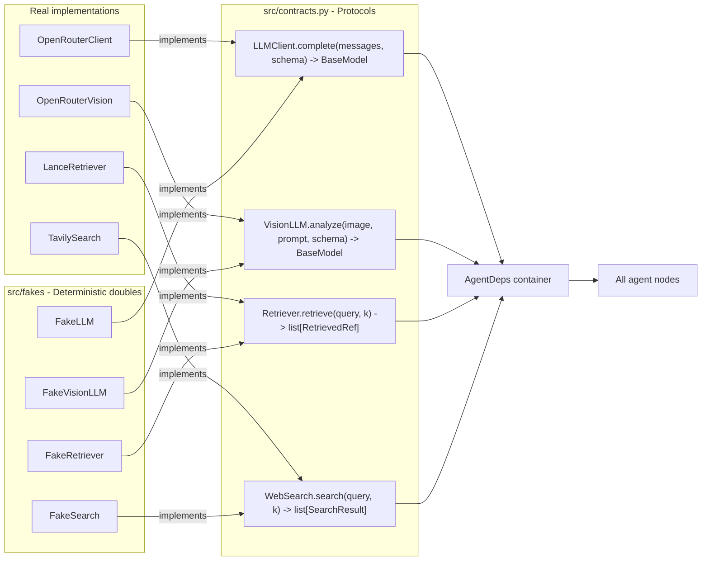

## Per-person architecture views

Each diagram below is the same system zoomed onto one person's responsibility. Solid arrows are owned files; dashed arrows are protocols/files this person *consumes* (built by someone else, but already mocked in `src/fakes/`).

### Person A - Infra and Orchestration

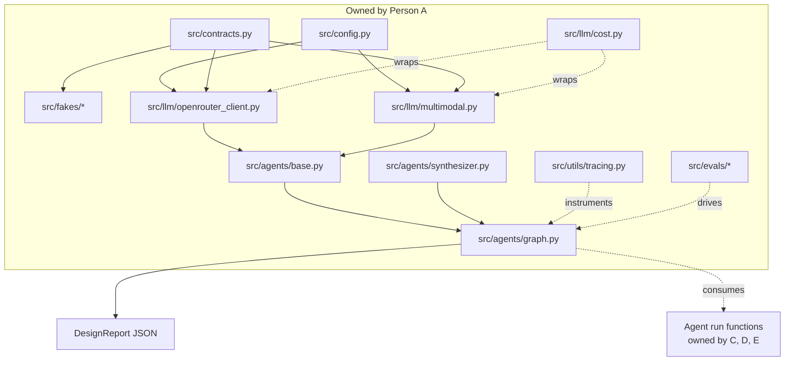

### Person B - Image RAG

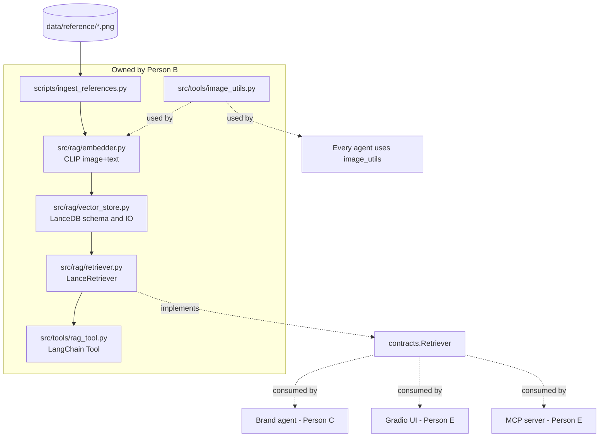

### Person C - Visual + Brand Consistency Agents

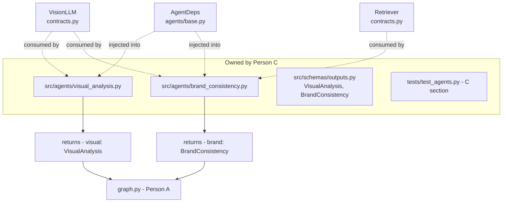

### Person D - UX + Accessibility Agents

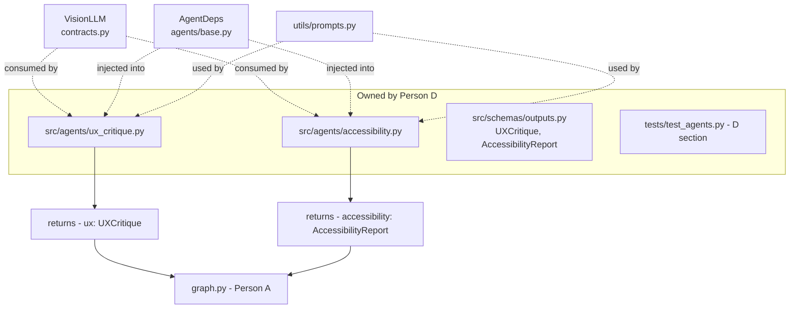

### Person E - Market Agent + UI + MCP

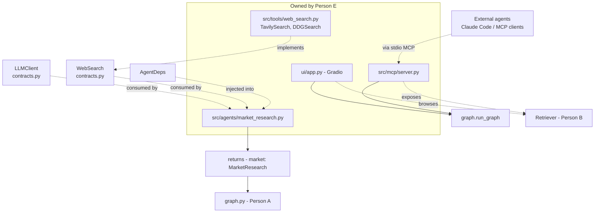

## Architecture FAQ

Direct answers to four questions everyone asks first. Read this if any of "is RAG a MCP?", "are agents truly parallel?", or "does this scale?" is unclear.

### Q1 - Is Image RAG a MCP?

No. They are two completely separate concepts that we use together.

- **Image RAG** = Retrieval-Augmented Generation over images. Embed images (and short text queries) into the same vector space using CLIP, store the vectors in LanceDB, retrieve the top-k nearest matches for a query. Lives in `src/rag/`. Sprint 3.
- **MCP** (Model Context Protocol) = a wire-protocol standard for exposing tools and resources to external LLM agents (Claude Code or any other MCP-compatible client) over stdio or HTTP JSON-RPC. Lives in `src/mcp/server.py`. Sprint 4.

They are orthogonal: RAG is a retrieval technique; MCP is a transport/protocol. You can have RAG without MCP, or MCP without RAG. We use both.

### How they connect in our app

The MCP server exposes our Image RAG (and the whole graph) as callable tools to the outside world. When an external coding agent calls `search_designs`, the request travels MCP -> our server -> `LanceRetriever.retrieve_by_text` -> back over MCP.

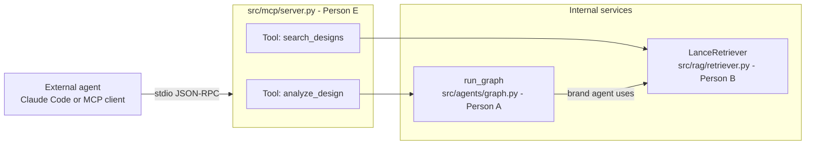

So the connection is: **MCP is one way the outside world reaches our Image RAG**, and **the brand agent is another way the inside world reaches our Image RAG**. RAG sits at the bottom; both clients sit on top.

### Q2 - Are all agents running in parallel?

Yes - structurally and on the wire.

- The LangGraph StateGraph has zero edges between the five specialist agents. From `START`, the graph fans out to all five at once; each one only depends on the initial `GraphState`. They all converge on the synthesizer.
- Every agent's `run(state, deps)` is `async`. `OpenRouterClient.complete` and `OpenRouterVision.analyze` are async (built on `openai.AsyncClient`). Tools (`TavilySearch`, `LanceRetriever`) expose async wrappers.
- LangGraph executes the parallel branches with `asyncio.gather`. Five LLM calls leave the host in the same event-loop tick.

End-to-end latency is therefore `max(agent_latency) + synthesizer_latency`, not `sum(agent_latency)`.

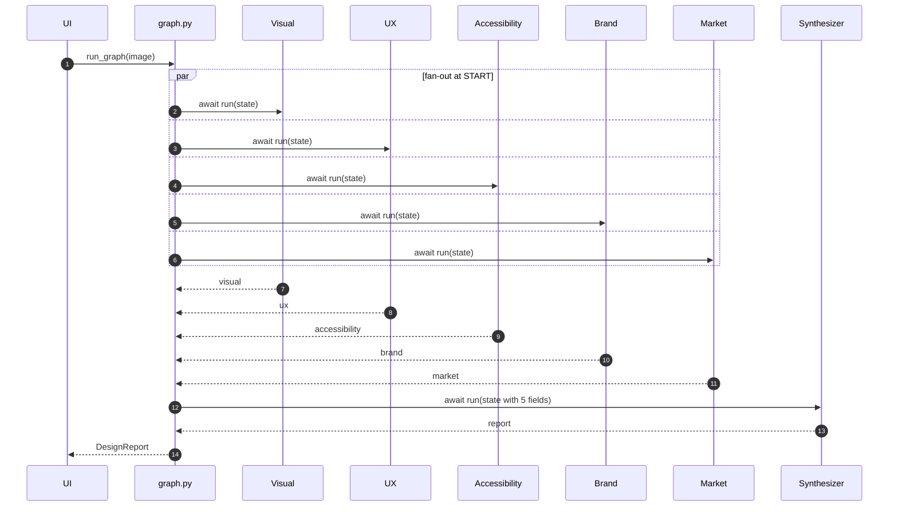

### Q3 - Are all agents called at the exact same instant?

Effectively yes, with one nuance worth knowing.

- The four LLM-only branches (visual, UX, accessibility, market-LLM) fire their `await deps.vision.analyze(...)` calls within the same event-loop tick.
- The brand branch does one extra step before its LLM call: `await deps.retriever.retrieve_by_image(...)` (50-200 ms on CPU). It does NOT block the others - they keep streaming.
- The market branch does one extra step before its LLM call: `await deps.search.search(...)` (300-800 ms over Tavily). Same story - non-blocking for the others.

Visualised in the LangSmith trace, you see five rows starting at roughly the same x-coordinate; the brand and market rows each have a small "tool call" segment before their "LLM call" segment.

### Implementation hint (Person A enforces this)

```python
# src/agents/graph.py
from langgraph.graph import StateGraph, START, END

async def visual_node(state: GraphState) -> dict:
    return await visual_run(state, deps)
# ...same for ux, accessibility, brand, market

g = StateGraph(GraphState)
g.add_node("visual", visual_node)
# ...
g.add_edge(START, "visual")
g.add_edge(START, "ux")
g.add_edge(START, "accessibility")
g.add_edge(START, "brand")
g.add_edge(START, "market")
g.add_edge("visual", "synthesizer")
g.add_edge("ux", "synthesizer")
g.add_edge("accessibility", "synthesizer")
g.add_edge("brand", "synthesizer")
g.add_edge("market", "synthesizer")
g.add_edge("synthesizer", END)
compiled = g.compile()
# Use compiled.ainvoke(state) - NOT invoke - to keep parallelism real.
```

If anyone writes a synchronous `def run`, fan-out becomes structural-only (LangGraph still calls them, just one after another on a single thread). The plan baseline is async; sync is allowed only if a library forces it.

### Q4 - Is this app built for scale?

Honest answer: **no, it is a hackathon prototype**, but it is factored so the swap to scale is mostly mechanical, not architectural.

What is hackathon-grade today:

- In-process LangGraph - fine for ~10 concurrent uploads.
- Disk-backed JSON cache for LLM responses (`data/cache/<sha256>.json`).
- Embedded LanceDB in the app process.
- Single-process Gradio with its built-in queue.
- stdio MCP server - one client at a time.
- No auth, no multi-tenancy.
- All settings in one `.env`.

### What would change for production scale (priority order)

1. **Move the orchestrator behind a job queue** - Celery + Redis or Temporal. Every upload becomes a durable task; UI subscribes to events via WebSocket/SSE.
2. **Lock down async everywhere** - already planned; CI test ensures no sync IO leaks into agent paths.
3. **Replace disk cache with Redis** - shared across instances, LRU eviction, TTL, hit-rate metrics.
4. **Vector DB for the corpus** - LanceDB on shared object storage (S3) or migrate to a managed Pinecone/Qdrant once the corpus exceeds 100k entries.
5. **Rate limit + budget** - leaky-bucket per user; per-tenant spend ceiling enforced inside `cost.py`.
6. **Multi-tenancy** - tenant_id column in LanceDB, per-tenant API keys, per-tenant LangSmith projects, per-tenant `.env` overlay.
7. **Auth + transport** - swap stdio MCP for HTTP MCP behind a reverse proxy; OAuth/API-token at the gateway.
8. **Structured logs** - loguru -> JSON to stdout, shipped via Vector/Fluent Bit to Loki or ELK.
9. **Metrics + dashboards** - Prometheus counters for agent latency, cache hit rate, eval pass rate, $/run; Grafana panels.
10. **Horizontal scaling** - agent workers are stateless Python processes; pull jobs from the queue; auto-scale on queue depth.
11. **GPU pool for CLIP** - batch image embeddings on a small GPU pool when ingest throughput grows; CPU is the fallback.
12. **Eval as CI gate** - the golden set runs on every PR; merges blocked if pass rate drops below threshold.
13. **Cost ceilings + alerting** - per-tenant budgets, Slack alert on overage.

### Why this is a scoring win

- **Difficulty Score**: this section is the proof we understand the production design space, not just hackathon code.
- **Code Quality**: keeping agents pure (`def run(state, deps)`), the LLM behind a `Protocol`, and IO behind contracts means each item above is a one-file swap, not a rewrite.
- **Concept Score**: every Sprint 5 cost-optimization concept (caching, batching, tiering, prompt optimization) is already in the design - we just push the same primitives into Redis instead of disk for production.

The top-level `README.md`'s "What we did not build" section will summarize this list verbatim so judges see we know the gap.

## Tech stack (one tool per concept, each one taught in C7)

Trimmed to one library per concept - no duplicates.

- **LLM gateway**: `openai` SDK pointed at OpenRouter (Sprint 1 - OpenAI standard). One key, many models. Locked in.
- **Multi-agent**: `langgraph` (Sprint 5 - LangGraph)
- **Chains/tools/memory primitives**: `langchain-core` only (Sprint 5 - LangChain)
- **Tracing**: `langsmith` (Sprint 5 - LangSmith)
- **Image RAG**: `lancedb` + `open_clip_torch` (Sprint 3 - LanceDB + CLIP). LlamaIndex is referenced once for concept claim; we do not build a full multimodal index.
- **Local model stub**: `transformers` only (Sprint 2 - HuggingFace). Thin stub file for concept; not on the demo path.
- **UI**: `gradio` (Sprint 2 - Gradio)
- **Structured output**: `pydantic` v2 + OpenRouter `response_format=json_schema` (Sprint 1 - JSON prompting). No `instructor`, no second framework.
- **Web search tool**: `tavily-python` + `duckduckgo-search`
- **MCP server**: `mcp` Python SDK (Sprint 4 - MCP). Two tools only.
- **Evals**: minimal in-house harness, schema-validity scoring only (Sprint 4 - Evals).
- **Cost optimization**: disk-backed JSON response cache (Sprint 5 - Cost Optimization). Model-tier function is a one-line stub.
- **Quality**: `pytest`, `ruff`, `black`, `mypy`

Removed (was bloat or duplication): `litellm`, `instructor`, `streamlit-extras`, `langchain-community`, `langchain-openai`, `beautifulsoup4`, `huggingface_hub`, `llama-index-multi-modal-llms-openai`, `llama-index-embeddings-clip`, pre-commit.

## Concept coverage map (for the demo slide)

After cuts, every Sprint still has a real file the judges can point at:

- Sprint 1 - prompt engineering (XML/JSON-mode), OpenAI standard via OpenRouter -> every agent prompt + `src/llm/openrouter_client.py`.
- Sprint 2 - Gradio UI + HuggingFace local stub -> `ui/app.py` + `src/llm/hf_local.py` (thin stub).
- Sprint 3 - chunking, CLIP embeddings, LanceDB vector DB, LlamaIndex (referenced) -> `src/rag/*`.
- Sprint 4 - Evals (schema-validity harness), MCP server -> `src/evals/*` + `src/mcp/server.py`.
- Sprint 5 - LangChain tool wrapper, LangGraph multi-agent state machine, LangSmith tracing, cost cache -> `src/tools/rag_tool.py` + `src/agents/graph.py` + `src/utils/tracing.py` + `src/llm/cost.py`.
- Sprint 6 - parallel multi-agent fan-out + structured aggregated report -> `src/agents/graph.py` + `src/agents/synthesizer.py`.

Dropped from scope (no concept-score impact): n8n webhook, Discord bot, Codex coding-agent integration, full LlamaIndex multimodal index, Instructor, pre-commit hooks, console scripts.

## Final project structure

```
ai_c7_hackathon/
  README.md                   # main project README - setup, demo, concept-coverage
  Makefile
  pyproject.toml
  requirements.txt            # alias - "-r requirements/all.txt"
  requirements/
    base.txt                  # shared by everyone (pydantic, openai, loguru, ...)
    person-a-infra.txt        # langgraph, langsmith, litellm
    person-b-rag.txt          # lancedb, open_clip_torch, torch, llama-index
    person-c-agents.txt       # base only - vision agents
    person-d-agents.txt       # base + opencv (contrast pass)
    person-e-ui.txt           # gradio, tavily, duckduckgo-search, mcp
    dev.txt                   # pytest, ruff, black, mypy
    all.txt                   # -r every other file (one-stop install)
  docs/
    PERSON_A_infra.md         # personalised README for Person A
    PERSON_B_rag.md           # ditto
    PERSON_C_visual_brand.md
    PERSON_D_ux_accessibility.md
    PERSON_E_market_ui_mcp.md
    ARCHITECTURE.md           # exported diagrams + design notes
    DEMO_SCRIPT.md            # 90-second hackathon walkthrough
    CONCEPT_COVERAGE.md       # the slide for the judges
    walkthrough.html          # self-contained interactive flow demo (Mermaid + Prism, no build)
  .env.example
  .gitignore
  src/
    __init__.py
    config.py                 # ALREADY CREATED (will keep)
    contracts.py              # NEW - Protocol classes that define every seam
    llm/
      __init__.py             # revise (drop CrewAI refs)
      openrouter_client.py    # LLMClient impl - OpenAI-compat client to OpenRouter
      multimodal.py           # VisionLLM impl - vision message helper + JSON-mode wrapper
      cost.py                 # response cache + tiered model selector (Sprint 5)
      hf_local.py             # optional LLMClient impl using HF transformers (Sprint 2)
    rag/
      __init__.py
      embedder.py             # open_clip image+text embeddings
      vector_store.py         # LanceDB wrapper - schema, write, query
      retriever.py            # Retriever impl - k-NN retrieve + LlamaIndex multimodal RAG
    schemas/
      __init__.py
      outputs.py              # Pydantic models: per-agent outputs, RetrievedRef, SearchResult, GraphState, DesignReport
    tools/
      __init__.py
      web_search.py           # WebSearch impl - Tavily + DuckDuckGo fallback
      image_utils.py          # resize, side-by-side compare, base64 encode, EXIF strip
      rag_tool.py             # LangChain BaseTool wrapping the Retriever protocol
    fakes/
      __init__.py             # NEW - re-export every fake
      fake_llm.py             # FakeLLM, FakeVisionLLM (deterministic, schema-valid)
      fake_retriever.py       # FakeRetriever returning canned references
      fake_search.py          # FakeSearch returning canned web hits
      fixtures.py             # path to a sample design image used by all fakes
    agents/
      __init__.py
      base.py                 # AgentDeps dataclass + run_with_schema() helper
      visual_analysis.py      # VisualAnalysisAgent - uses VisionLLM
      ux_critique.py          # UXCritiqueAgent - uses VisionLLM
      market_research.py      # MarketResearchAgent - uses LLMClient + WebSearch
      accessibility.py        # AccessibilityAgent - uses VisionLLM
      brand_consistency.py    # BrandConsistencyAgent - uses VisionLLM + Retriever
      synthesizer.py          # SynthesizerAgent - uses LLMClient, aggregates JSON
      graph.py                # LangGraph StateGraph wiring all 6 nodes with parallel fan-out
    evals/
      __init__.py
      harness.py              # rubric-based + LangSmith evaluators (Sprint 4)
      golden_set.py           # seeded test cases + expected fields
    mcp/
      __init__.py
      server.py               # MCP server - tools: analyze_design, search_designs
    utils/
      __init__.py             # ALREADY CREATED
      logger.py               # ALREADY CREATED (loguru)
      prompts.py              # ALREADY CREATED (system prompts registry)
      tracing.py              # LangSmith setup helper - graceful no-op if unset
  ui/
    app.py                    # Gradio Blocks: upload, run, streaming logs, structured tabs
  scripts/
    ingest_references.py      # walk data/reference, embed, write to LanceDB
    run_evals.py              # CLI to run the evals harness
  tests/
    conftest.py               # shared fixtures: tmp config, fake AgentDeps, sample image
    test_schemas.py           # cross-cutting - schema validity (Person A)
    test_contracts.py         # cross-cutting - Protocol runtime checks (Person A)
    test_fakes.py             # cross-cutting - fakes round-trip every schema (Person A)
    person_a/
      test_openrouter.py      # @pytest.mark.real_api - real OpenRouter call
      test_cost.py            # cache + tier selection
      test_synthesizer.py     # aggregates fake outputs into DesignReport
      test_graph.py           # full graph runs end-to-end with fakes
    person_b/
      test_embedder.py        # CLIP normalizes, dim correct
      test_vector_store.py    # LanceDB upsert + query against tmp dir
      test_retriever.py       # Retriever protocol contract; top-k order
      test_rag_tool.py        # LangChain Tool returns valid JSON
    person_c/
      test_visual_analysis.py
      test_brand_consistency.py
    person_d/
      test_ux_critique.py
      test_accessibility.py
    person_e/
      test_market_research.py
      test_web_search.py      # mocks HTTP; real_api variant calls Tavily
      test_ui_smoke.py        # Gradio Blocks builds without error
      test_mcp_server.py      # MCP server lists tools and serves analyze_design
  data/
    uploads/   reference/   reports/   cache/   vector_store/
```

## Files already created vs. to-create / revise

Already on disk and keeping (no changes needed):
- [.gitignore](.gitignore), [.env.example](.env.example), [pyproject.toml](pyproject.toml), [Makefile](Makefile)
- [src/__init__.py](src/__init__.py), [src/config.py](src/config.py)
- [src/utils/__init__.py](src/utils/__init__.py), [src/utils/logger.py](src/utils/logger.py), [src/utils/prompts.py](src/utils/prompts.py)

Already on disk but **needs revision** (CrewAI/ChromaDB references must change to LangGraph/LanceDB):
- [requirements.txt](requirements.txt) - replace contents with a single line: `-r requirements/all.txt`. Move every dep into the per-person split files described in the blueprint.
- [src/llm/__init__.py](src/llm/__init__.py) - drop `OpenRouterClient`/`MultimodalLLM` re-exports until those modules exist (currently broken import).
- [.env.example](.env.example) - rename `VECTOR_STORE_DIR` to a LanceDB URI; remove Chroma collection knob, keep CLIP knobs, add LangSmith knobs, add MCP knobs.

To create (new):
- Requirements split: `requirements/{base,person-a-infra,person-b-rag,person-c-agents,person-d-agents,person-e-ui,dev,all}.txt`
- Per-person READMEs: `docs/PERSON_{A_infra,B_rag,C_visual_brand,D_ux_accessibility,E_market_ui_mcp}.md`
- Shared docs: `docs/{ARCHITECTURE,DEMO_SCRIPT,CONCEPT_COVERAGE}.md`
- Contracts: `src/contracts.py`
- Fakes: `src/fakes/{__init__,fake_llm,fake_retriever,fake_search,fixtures}.py` plus `src/fakes/fixtures/sample.png`
- LLM layer: `src/llm/{openrouter_client,multimodal,cost,hf_local}.py`
- RAG: `src/rag/{__init__,embedder,vector_store,retriever}.py`
- Schemas: `src/schemas/{__init__,outputs}.py`
- Tools: `src/tools/{__init__,web_search,image_utils,rag_tool}.py`
- Agents: `src/agents/{__init__,base,visual_analysis,ux_critique,market_research,accessibility,brand_consistency,synthesizer,graph}.py`
- Evals: `src/evals/{__init__,harness,golden_set}.py`
- MCP: `src/mcp/{__init__,server}.py`
- UI: `ui/app.py` (Gradio)
- Scripts: `scripts/ingest_references.py`, `scripts/run_evals.py`
- Tests: `tests/{conftest,test_schemas,test_contracts,test_fakes,test_rag,test_agents,test_graph}.py`
- Top-level `README.md`

Every file will include real working stubs (importable, type-checked) plus inline `TODO` comments and "logic hints" so each teammate can finish their slice without rereading the whole repo.

## Detailed file blueprints

Each blueprint below lists the file's purpose, public surface (function/class signatures with one-line docstrings), inline TODOs, and logic hints. Treat these as the contract; teammates fill in bodies.

### `src/schemas/outputs.py` (Owner: Person A, but reviewed by all)

Purpose: Single source of truth for every typed object that crosses a module boundary. If two modules disagree, the schema wins.

Public surface:

- `class Severity(str, Enum)` - `low | medium | high | critical`
- `class Finding(BaseModel)` - `title: str, description: str, severity: Severity, evidence: str, recommendation: str`
- `class VisualAnalysis(BaseModel)` - `layout, hierarchy, palette: list[str], typography, spacing_notes, density_score: float, observations: list[str]`
- `class UXCritique(BaseModel)` - `heuristic_violations: list[Finding], cognitive_load_score: float, friction_points: list[Finding]`
- `class AccessibilityReport(BaseModel)` - `wcag_findings: list[Finding], contrast_pass: bool | None, est_min_touch_target_px: int | None`
- `class CompetitorRef(BaseModel)` - `name, url, why_relevant`
- `class MarketResearch(BaseModel)` - `competitors: list[CompetitorRef], trends: list[str], opportunities: list[str], threats: list[str], citations: list[str]`
- `class BrandConsistency(BaseModel)` - `consistency_score: float, color_drift, type_drift, component_drift, comparable_refs: list[RetrievedRef]`
- `class RetrievedRef(BaseModel)` - `id, score: float, image_path: str, metadata: dict`
- `class SearchResult(BaseModel)` - `title, url, snippet`
- `class Recommendation(BaseModel)` - `title, rationale, effort: Literal["S","M","L"], impact: Literal["S","M","L"]`
- `class DesignReport(BaseModel)` - aggregates all six outputs + `overall_score: float (0-100)` + `top_strengths: list[str]` + `top_recommendations: list[Recommendation]`
- `class GraphState(BaseModel)` - LangGraph state: `image_path`, `image_b64`, `instructions: str | None`, plus optional fields filled by each agent (`visual: VisualAnalysis | None`, etc.) and `report: DesignReport | None`

TODO list inside the file:

- Mark every list/optional field with a sensible default so partial states validate.
- Add `model_config = ConfigDict(extra="forbid")` so LLM hallucinated fields fail fast.
- Add `@field_validator` for `palette` to enforce hex strings.
- Add `Score = Annotated[float, Field(ge=0, le=100)]` alias.

Logic hints:

- Keep schemas dumb (no methods beyond validators). Behaviour belongs in agents.
- Every agent's output schema must be JSON-Schema-serializable so we can pass `response_format={"type":"json_schema", ...}` to OpenRouter.

### `src/contracts.py` (Owner: Person A)

Purpose: Define the seams between people. Every module that *consumes* an LLM, retriever, or search engine codes against a `Protocol`, never a concrete class. This is what makes "container per person" possible.

Public surface (all `typing.Protocol`, runtime-checkable):

- `class LLMClient(Protocol)`:
  - `def complete(self, *, system: str, user: str, schema: type[BaseModel], model: str | None = None, temperature: float | None = None) -> BaseModel` - text-only structured completion. Returns a validated instance of `schema`.
- `class VisionLLM(Protocol)`:
  - `def analyze(self, *, system: str, user: str, images: list[Path | str], schema: type[BaseModel], model: str | None = None) -> BaseModel` - multimodal structured completion. Accepts file paths or base64 data URIs.
- `class Retriever(Protocol)`:
  - `def retrieve_by_image(self, image_path: Path | str, k: int = 5) -> list[RetrievedRef]`
  - `def retrieve_by_text(self, text: str, k: int = 5) -> list[RetrievedRef]`
- `class WebSearch(Protocol)`:
  - `def search(self, query: str, k: int = 5) -> list[SearchResult]`

TODO list inside the file:

- Use `@runtime_checkable` so `isinstance(x, LLMClient)` works in tests.
- Add `Embedder` protocol if/when we expose embedding outside `rag/`.
- Document the cost-tier hint: `model: str | None = None` lets the cost layer pick a cheap model unless overridden.

Logic hints:

- Protocols are import-cheap; do not import torch / openai here.
- Real implementations live in `src/llm/` and `src/rag/`; fakes live in `src/fakes/`. Both satisfy these protocols.

### `src/fakes/` (Owner: Person A, used by everyone)

Purpose: Deterministic, schema-valid stand-ins that let any teammate run their slice with zero external deps.

Files:

- `fake_llm.py`:
  - `class FakeLLM(LLMClient)` - returns a hardcoded `schema(**canned)` per schema-name lookup; raises if asked for an unknown schema.
  - `class FakeVisionLLM(VisionLLM)` - same pattern; ignores `images` content but checks that paths exist.
- `fake_retriever.py`:
  - `class FakeRetriever(Retriever)` - returns 3 canned `RetrievedRef`s pointing at `fakes/fixtures/*.png`.
- `fake_search.py`:
  - `class FakeSearch(WebSearch)` - returns 3 canned `SearchResult`s with stable URLs.
- `fixtures.py`:
  - `SAMPLE_DESIGN: Path` - bundled small PNG used as default upload in every per-slice runner.

TODO list:

- Bundle 1-2 tiny PNGs (under 50 KB) under `src/fakes/fixtures/`; keep them in git.
- Make all fakes pure-Python with no third-party imports beyond pydantic.
- Add a `record_replay/` mode later: real LLM call -> JSON file; subsequent runs replay (optional, post-MVP).

Logic hints:

- Canned data must satisfy *every* required field of the target schema. Use the `model_construct` escape only as a last resort.
- Fakes are the single biggest unblocker: invest 30 minutes here so the other 4 people can ship in parallel.

### `src/llm/openrouter_client.py` (Owner: Person A)

Purpose: Real `LLMClient` over OpenRouter using the OpenAI SDK (Sprint 1 - OpenAI standard).

Public surface:

- `class OpenRouterClient(LLMClient)`:
  - `def __init__(self, settings: Settings | None = None)` - reads key, base URL, app/site headers from `settings`.
  - `def complete(self, *, system, user, schema, model=None, temperature=None) -> BaseModel` - calls `chat.completions.create` with `response_format={"type":"json_schema","json_schema":{...}}` derived from `schema.model_json_schema()`. Validates and returns `schema(**parsed)`.
  - `def _client(self) -> openai.OpenAI` - lazy-construct the SDK client with `base_url=settings.openrouter_base_url` and `default_headers={"HTTP-Referer": site_url, "X-Title": app_name}`.
- `def get_openrouter_client() -> OpenRouterClient` - module-level singleton.

TODO list:

- Retry on `RateLimitError` with exponential backoff (3 tries, base 1.5).
- Fall back to plain `response_format={"type":"json_object"}` + manual `pydantic.TypeAdapter` validation if the model id does not support JSON Schema.
- Pass `extra_body={"provider": {"order": [...]}}` if we want explicit provider routing.
- Bubble up `model_dump()` of the prompt for cost-layer hashing.

Logic hints:

- OpenRouter is OpenAI-compatible; do not pull in the `openrouter` package - just use `openai`.
- Wrap the call so `cost.py` can intercept (we will plug a decorator).

### `src/llm/multimodal.py` (Owner: Person A)

Purpose: Real `VisionLLM`. Builds OpenAI-style multimodal messages and enforces structured output.

Public surface:

- `def encode_image_to_data_url(path: Path | str) -> str` - reads bytes, infers mime from suffix, returns `"data:image/png;base64,..."`. Strips EXIF for privacy.
- `def vision_message(prompt: str, images: list[Path | str]) -> list[dict]` - returns OpenAI `messages` payload `[{"role":"user","content":[{"type":"text","text":...},{"type":"image_url","image_url":{"url":...}}, ...]}]`.
- `class OpenRouterVision(VisionLLM)`:
  - `def __init__(self, llm: OpenRouterClient | None = None)`.
  - `def analyze(self, *, system, user, images, schema, model=None) -> BaseModel` - constructs the system+user messages, attaches images, calls the LLM with `response_format` for the schema.

TODO list:

- Resize images to <= 1568px max side before encoding (matches Anthropic limits, fine for OpenAI).
- For >2 images, build a single side-by-side composite via `tools.image_utils.side_by_side` to keep token cost predictable.
- Default `model=settings.default_vision_model` but allow override.

Logic hints:

- Most cost wins come from resizing. A 4K screenshot is ~2400 tokens; resized 1024px is ~700.
- Always pass `system` separately; do not concatenate with user text.

### `src/llm/cost.py` (Owner: Person A) - Sprint 5 Cost Optimization

Purpose: Stop paying twice for the same prompt. The cache is the whole win for a hackathon demo; tier selection is a one-liner stub.

Public surface:

- `def prompt_hash(*, system: str, user: str, images: list[str], schema_name: str, model: str) -> str` - SHA256 of a stable JSON of inputs.
- `class ResponseCache`:
  - `def __init__(self, dir: Path)`.
  - `def get(self, key: str) -> dict | None` - returns parsed JSON or None.
  - `def put(self, key: str, value: dict) -> None` - writes `data/cache/<key>.json`.
- `def select_model(task: str = "default") -> str` - one-liner returning `settings.default_vision_model` or `settings.default_text_model`. Documented as "extension point for tiered selection later".
- `def cached(fn)` - decorator for `LLMClient.complete` / `VisionLLM.analyze` that hashes inputs, looks up cache, and writes through.

TODO list:

- Add `CACHE_DISABLED=1` env override for evals runs (one if-statement).
- Per-day spend ceiling is a stretch goal.

Logic hints:

- Caching is the demo super-power: re-running the same screenshot is free and instant. Wire `cached` BEFORE writing demo data.
- Keep `select_model` boring; we are not building a routing system in 20 hours.

### `src/llm/hf_local.py` (Owner: Person A, thin stub) - Sprint 2 HuggingFace

Purpose: Concept-claim file for Sprint 2 "local models". Tiny stub - not on the demo path.

Public surface (~30 lines total):

- `class HFLocalClient(LLMClient)`:
  - `def __init__(self, model_id: str = "Qwen/Qwen2.5-0.5B-Instruct")`.
  - `def complete(...)` - lazy-imports `transformers`, builds a JSON-output system prompt, runs the pipeline, parses + validates against `schema`. Raises a clear "install transformers via requirements/optional-hf.txt" error if missing.

TODO list:

- Keep it small. Do not pull torch GPU paths into this file.
- Document in the docstring: "This file exists for concept coverage; the demo uses OpenRouter."
- If a teammate has spare time post-MVP, expand to Outlines/lm-format-enforcer for grammar-constrained JSON.

Logic hints:

- `transformers` is not in any default install. The class fails at import time with a useful message if you forgot the optional install.

### `src/rag/embedder.py` (Owner: Person B) - Sprint 3 Embeddings

Purpose: One CLIP model, two methods - `embed_image` and `embed_text` - aligned in the same vector space so we can do image-image and text-image retrieval.

Public surface:

- `class CLIPEmbedder`:
  - `def __init__(self, model_name=settings.clip_model, pretrained=settings.clip_pretrained, device: str | None = None)`.
  - `def embed_image(self, image: Path | str | PIL.Image.Image) -> np.ndarray` - returns L2-normalized 512-d float32 vector.
  - `def embed_text(self, text: str) -> np.ndarray` - same shape.
  - `dim: int` - exposed property used by vector_store to size the schema.

TODO list:

- Cache the loaded model on the class (one global instance).
- Auto-select device: `cuda` if available else `cpu`; print a warning if CPU and image count > 50.
- Add an `embed_batch(images)` method for bulk ingestion.

Logic hints:

- Always L2-normalize so cosine similarity == dot product.
- `open_clip_torch` ships many checkpoints - default `ViT-B-32 / laion2b_s34b_b79k` is small and CPU-runnable.

### `src/rag/vector_store.py` (Owner: Person B) - Sprint 3 LanceDB

Purpose: Thin LanceDB wrapper that hides table creation, schema, and bulk write.

Public surface:

- `def open_db() -> lancedb.DBConnection` - opens `settings.vector_store_dir`.
- `def get_or_create_table(db, *, name=settings.vector_collection, dim: int) -> lancedb.table.Table` - schema: `id: str, vector: vector(dim), image_path: str, source: str, tags: list[str], description: str`.
- `def upsert_records(table, records: list[dict]) -> None` - delete-by-id then add.
- `def query_by_vector(table, vector: np.ndarray, k: int = 5, where: str | None = None) -> list[dict]`.

TODO list:

- Use a fixed table name from `settings.vector_collection` so ingest and read agree.
- Store `image_path` as a *relative* path under `data/reference` so the DB is portable.
- Add `count()` and `clear()` helpers for the ingest CLI.

Logic hints:

- LanceDB writes columnar Arrow files; do bulk inserts in batches of 100 to keep memory flat.
- A `tags` column lets the brand agent filter "same-brand" references easily.

### `src/rag/retriever.py` (Owner: Person B) - implements `Retriever` contract

Purpose: User-facing retrieval. Wraps embedder + vector store; exposes image-query and text-query.

Public surface:

- `class LanceRetriever(Retriever)`:
  - `def __init__(self, embedder: CLIPEmbedder | None = None)`.
  - `def retrieve_by_image(self, image_path, k=5) -> list[RetrievedRef]`.
  - `def retrieve_by_text(self, text, k=5) -> list[RetrievedRef]`.
  - `def _to_ref(self, row: dict) -> RetrievedRef`.

LlamaIndex concept-claim (top of file, ~5 lines):

```python
# LOGIC: We import LlamaIndex's MultiModalVectorStoreIndex to claim Sprint 3
# coverage; the production retrieval path below uses LanceDB directly for
# speed. The full multimodal index is a documented post-MVP extension.
from llama_index.core.indices.multi_modal import MultiModalVectorStoreIndex  # noqa: F401
```

TODO list:

- Map LanceDB `_distance` to `score = 1 - distance` (cosine).
- Filter results below `score < 0.2`.

Logic hints:

- For brand consistency, prefer `retrieve_by_image` of the candidate; tags can narrow scope later.
- We do not build a full LlamaIndex multimodal index in v1 - the LanceDB direct path is faster and we already cover Sprint 3.

### `src/tools/web_search.py` (Owner: Person E) - implements `WebSearch` contract

Purpose: Real `WebSearch` for the Market Research agent.

Public surface:

- `class TavilySearch(WebSearch)`:
  - `def __init__(self, api_key: str | None = None)`.
  - `def search(self, query, k=5) -> list[SearchResult]` - calls `tavily.TavilyClient().search(query, max_results=k, include_answer=False)`.
- `class DuckDuckGoSearch(WebSearch)` - free fallback using `duckduckgo_search.DDGS().text(...)`.
- `def get_default_search() -> WebSearch` - Tavily if `TAVILY_API_KEY` set, else DuckDuckGo.

TODO list:

- Cache results to `data/cache/search/<sha256(query)>.json` for 24h.
- De-duplicate hits by host when k > 5.
- Strip tracking params from URLs before returning.

Logic hints:

- Tavily returns clean snippets that are LLM-ready; DDG returns rawer text - the agent prompt has to be more defensive.

### `src/tools/image_utils.py` (Owner: Person B, used by everyone)

Purpose: Pure image helpers - no LLM, no network.

Public surface:

- `def load_image(path) -> PIL.Image.Image`.
- `def resize_max_side(img, max_side=1024) -> PIL.Image.Image`.
- `def to_data_url(img, fmt="PNG") -> str`.
- `def side_by_side(images: list[PIL.Image.Image], gap=8, bg=(255,255,255)) -> PIL.Image.Image` - one composite image for the LLM instead of N separate uploads.
- `def annotate_box(img, box, label) -> PIL.Image.Image` - used in the report tab to highlight findings.
- `def thumbnail(path, size=(256,256)) -> PIL.Image.Image` - for the Gradio gallery.

TODO list:

- Keep functions pure and small.

### `src/tools/rag_tool.py` (Owner: Person B, thin pass-through) - Sprint 5 LangChain tools

Purpose: Concept-claim file for Sprint 5 "LangChain tools". Thin BaseTool wrapper around the `Retriever` protocol so the project visibly demonstrates LangChain-style tool definitions. No agent depends on it on the critical path; the brand agent calls the retriever directly.

Public surface (~25 lines):

- `class RAGSearchInput(BaseModel)` - `query: str, k: int = 5, by: Literal["text","image"] = "text"`.
- `class RAGSearchTool(BaseTool)`:
  - `name = "rag_search_designs"`.
  - `description` - one sentence the LLM could read.
  - `args_schema = RAGSearchInput`.
  - `def __init__(self, retriever: Retriever)`.
  - `def _run(self, query, k, by) -> str` - returns JSON-serialized list of `RetrievedRef`.

TODO list:

- Keep it under 30 lines. Do not invent novel features here.

Logic hints:

- If we later expose retrieval over MCP-as-tool to LLMs, this file's `description` is reused verbatim.

### `src/agents/base.py` (Owner: Person A)

Purpose: The shared "AgentDeps container" + utilities every agent uses.

Public surface:

- `@dataclass class AgentDeps` - `llm: LLMClient, vision: VisionLLM, retriever: Retriever, search: WebSearch, settings: Settings, logger`. This is the "container" each person can construct with fakes.
- `def build_default_deps(use_real: bool = False) -> AgentDeps` - returns fakes by default; if `use_real`, wires `OpenRouterClient`, `OpenRouterVision`, `LanceRetriever`, `TavilySearch`. Reads `USE_REAL` env if `use_real` is None.
- `def run_with_schema(agent_name: str, system: str, user: str, *, deps: AgentDeps, images: list[Path] | None = None, schema: type[BaseModel]) -> BaseModel` - generic helper that picks `vision.analyze` if `images` else `llm.complete`, traces the call with LangSmith, and returns the validated result.

TODO list:

- Add `with traced(agent_name)` context manager from `utils.tracing`.
- Add `cost_budget: int | None` to `AgentDeps`; bubble down to `cost.cached`.
- Provide `from_env()` classmethod on `AgentDeps`.

Logic hints:

- This file is the single import an agent needs: `from src.agents.base import AgentDeps, run_with_schema`.
- Keep agents pure: `def run(state: GraphState, deps: AgentDeps) -> dict`. No global state.

### `src/agents/visual_analysis.py` (Owner: Person C)

Purpose: Inspect the candidate design and emit a `VisualAnalysis`.

Public surface:

- `def run(state: GraphState, deps: AgentDeps) -> dict` - returns `{"visual": VisualAnalysis(...)}` (LangGraph partial-state convention).
- `if __name__ == "__main__":` - argparse: `--image`, `--use-real`. Builds deps, calls `run`, prints JSON. This is the per-slice runner.

TODO list:

- Pull `system` from `utils.prompts.visual_analysis_system()`.
- Build `user` that includes any free-form `state.instructions` from the UI.
- After validation, log the dump at INFO; trace under name `agent.visual`.

Logic hints:

- Keep the agent file ~50 lines. All complexity is in prompts + schemas.
- Run with fakes: `python -m src.agents.visual_analysis --image src/fakes/fixtures/sample.png` should print a valid VisualAnalysis JSON.

### `src/agents/ux_critique.py` (Owner: Person D)

Purpose: Heuristic-style UX critique -> `UXCritique`.

Public surface: same shape as `visual_analysis` (`run`, `__main__`).

TODO list:

- Use `prompts.ux_critique_system()`.
- Add an XML-tagged user prompt (Sprint 1 concept) for `<context>...</context><task>...</task>`.
- Tie each Finding to severity using a small rubric in the prompt.

### `src/agents/accessibility.py` (Owner: Person D)

Purpose: WCAG audit -> `AccessibilityReport`.

Public surface: same shape.

TODO list:

- Reference WCAG 2.2 success criteria explicitly in the prompt.
- If color contrast can be measured from the image, add a tiny opencv pass to compute `contrast_pass` deterministically (bonus accuracy).

### `src/agents/market_research.py` (Owner: Person E)

Purpose: Use a short visual summary + web search results to produce `MarketResearch`.

Public surface:

- `def run(state: GraphState, deps: AgentDeps) -> dict` - 2-step:
  1. Build a short "design summary" string (use `state.visual` if present, else a short vision call).
  2. Run `deps.search.search(summary + " competitors")` and `... + " design trends"`; pass both to `deps.llm.complete` with `MarketResearch` schema.

TODO list:

- Include returned URLs as `citations`.
- Cap snippets to 800 chars each before passing to the LLM.
- Avoid running the visual summary if `state.visual` is already set (depends on graph order).

Logic hints:

- This agent is the easiest place to demo "tool use" - the LLM is *not* picking the tool, our code is, but conceptually this is a tool-augmented agent.

### `src/agents/brand_consistency.py` (Owner: Person C) - uses Retriever (Image RAG)

Purpose: Compare candidate against retrieved reference designs -> `BrandConsistency`.

Public surface:

- `def run(state: GraphState, deps: AgentDeps) -> dict` - 1) `refs = deps.retriever.retrieve_by_image(state.image_path, k=4)`, 2) build a side-by-side composite via `image_utils.side_by_side([candidate, *ref_imgs])`, 3) `deps.vision.analyze(...)` with the composite + the ref metadata.

TODO list:

- Pass `score` of each retrieved ref into the prompt so the LLM knows confidence.
- If retriever returns 0 refs, gracefully emit `consistency_score=0.5, comparable_refs=[]` and a "no references available" note.

Logic hints:

- This is the only agent that exercises image RAG end-to-end - protect its happy path.

### `src/agents/synthesizer.py` (Owner: Person A)

Purpose: Aggregate every specialist's structured output into a single `DesignReport`.

Public surface:

- `def run(state: GraphState, deps: AgentDeps) -> dict` - validates that all 5 specialist fields exist, builds a compact JSON of their dumps, calls `deps.llm.complete(system=prompts.synthesizer_system(), user=json.dumps(...), schema=DesignReport)`.

TODO list:

- Compute `overall_score` server-side from the specialists too (weighted avg) and feed it as a hint; let the LLM justify.
- Persist the report JSON to `data/reports/<timestamp>-<image_stem>.json`.

### `src/agents/graph.py` (Owner: Person A) - Sprint 5/6 LangGraph

Purpose: Wire all 6 agents into a parallel-fan-out + synthesis StateGraph.

Public surface:

- `def build_graph(deps: AgentDeps) -> CompiledStateGraph` - `StateGraph(GraphState)`; nodes wrap each agent's `run(state, deps)` partial; edges: `START -> [visual, ux, accessibility, brand, market]` in parallel, then all `-> synthesizer -> END`.
- `def run_graph(image_path: Path, *, instructions: str | None = None, deps: AgentDeps | None = None) -> DesignReport` - convenience wrapper used by the UI and the MCP server.

TODO list:

- Use LangGraph's `add_conditional_edges` only if we add a "skip if confidence low" branch later.
- Stream node updates so the UI can show progress (`graph.stream(...)`).
- Wire `langsmith` callbacks via `RunnableConfig`.

Logic hints:

- Parallel fan-out is the demo wow-factor; keep node functions short and side-effect-free.
- The synthesizer node is the only place that reads multiple agent outputs.

### `src/utils/tracing.py` (Owner: Person A) - Sprint 5 LangSmith

Purpose: Set up LangSmith if env is configured; degrade to local logs otherwise.

Public surface:

- `def init_tracing() -> None` - sets `LANGCHAIN_TRACING_V2`, `LANGCHAIN_API_KEY`, `LANGCHAIN_PROJECT` from settings; no-op if key missing.
- `@contextmanager def traced(name: str, **metadata)` - wraps a block as a LangSmith run; logs locally if no key.

### `ui/app.py` (Owner: Person E) - Sprint 2 Gradio

Purpose: The demo surface. Upload, run, watch progress, view structured report.

Public surface (Gradio Blocks):

- Tab 1 - "Analyze": file upload + "Run" button + streaming markdown log + collapsible JSON.
- Tab 2 - "Report": rendered `DesignReport` - top strengths, prioritized recommendations, per-agent findings as accordions, retrieved references as a gallery.
- Tab 3 - "References": browse / search the LanceDB corpus (calls `deps.retriever.retrieve_by_text`).
- Tab 4 - "Settings": pick model tier, toggle real vs fake deps (great for offline demo).

Functions:

- `def on_run(image, instructions, model_tier) -> Generator[tuple[str, dict], None, None]` - streams `graph.stream(...)` updates.
- `def render_report(report: DesignReport) -> tuple[gr.Markdown, gr.JSON, ...]`.
- `def main()` - builds Blocks, launches.

TODO list:

- Use `gr.Blocks(theme=gr.themes.Soft())` for polish.
- Persist last 10 runs in `data/reports/` and surface them in a sidebar.
- Wire a "Copy as Markdown" button for sharing.

### `src/evals/harness.py` + `golden_set.py` (Owner: shared, infra by A) - Sprint 4 Evals

Purpose: One quantitative number on the demo slide. Minimal scope: schema-validity over a handful of cases.

Public surface (~50 lines total):

- `class GoldenCase(BaseModel)` - `image_path: Path, instructions: str | None = None`.
- `GOLDEN_CASES: list[GoldenCase]` in `golden_set.py` - 3-5 hand-curated screenshots that everyone agrees represent the demo surface.
- `class EvalResult(BaseModel)` - `case: GoldenCase, schema_valid: dict[str, bool]` (one bool per agent), `pass_rate: float`.
- `def run_eval(case: GoldenCase, deps: AgentDeps) -> EvalResult` - calls `run_graph(case.image_path, ...)`; for each specialist field on the returned `DesignReport`, checks if the Pydantic model parses; aggregates a single `pass_rate`.
- `def aggregate(results: list[EvalResult]) -> EvalSummary` - mean pass rate, count of failures by agent.

TODO list:

- Print one final number ("Eval Pass Rate %") and per-agent breakdown.
- Free-text "LLM-as-judge" scoring is a post-MVP stretch.

Logic hints:

- Schema-validity is enough for hackathon judging - it proves the contract holds across the surface.
- Run with `CACHE_DISABLED=1` so we measure real LLM behavior, not cache hits.

### `src/mcp/server.py` (Owner: Person E) - Sprint 4 MCP

Purpose: Expose the analysis suite to other coding agents (Claude Code or any other MCP-compatible client). Two tools, ~80 lines.

Public surface (using the official `mcp` Python SDK):

- Tool `analyze_design`:
  - Input: `image_path: str, instructions: str | None`.
  - Output: serialized `DesignReport`.
  - Implementation: `run_graph(Path(image_path), instructions=instructions)`.
- Tool `search_designs`:
  - Input: `query: str, k: int = 5`.
  - Output: `list[RetrievedRef]`.
  - Implementation: `LanceRetriever().retrieve_by_text(query, k)`.
- `def main()` - starts a stdio MCP server.

TODO list:

- Provide an `mcp.json` snippet in the README so judges can wire it into their MCP client (e.g. Claude Code) on stage.
- Route loguru logs to stderr so MCP stdout JSON-RPC is clean.

Logic hints:

- Two tools is the right scope for the hackathon. A third (`ingest_reference`) is a clean post-MVP extension.

### `scripts/ingest_references.py` (Owner: Person B)

Purpose: Walk `data/reference/`, embed every image, write to LanceDB.

Public surface:

- argparse: `--source` (default `./data/reference`), `--clear` (drop and recreate the table), `--tag` (apply a tag to all rows from this run).
- `def main()` - find `*.png|*.jpg|*.webp`, call `CLIPEmbedder.embed_image`, build records, `upsert_records`.

TODO list:

- Show a Rich progress bar.
- Skip files already present (id = sha1 of file bytes).

### `tests/conftest.py` (Owner: Person A, shared)

Purpose: One place where everyone gets the same fixtures. This file is what makes "Person C's agent test runs in 0.05 seconds with no API key" possible.

Fixtures:

- `fake_llm()` - returns a `FakeLLM` instance.
- `fake_vision()` - returns a `FakeVisionLLM` instance.
- `fake_retriever()` - returns a `FakeRetriever` instance.
- `fake_search()` - returns a `FakeSearch` instance.
- `fake_deps(fake_llm, fake_vision, fake_retriever, fake_search)` - composed `AgentDeps` (the most-used fixture).
- `tmp_settings(tmp_path, monkeypatch)` - clones `settings`, retargets every `*_dir` to `tmp_path`, monkeypatches `src.config.settings` so any code under test sees the temp config.
- `sample_image()` - returns `Path(src/fakes/fixtures/sample.png)`.
- `tiny_png(tmp_path)` - generates a 64x64 solid-color PNG for ingestion-time tests (Person B uses this).
- `real_openrouter_skip()` - autouse skipper for `@pytest.mark.real_api` when `OPENROUTER_API_KEY` is missing.

Logic hints:

- All fixtures are `function`-scoped by default; mark `module`/`session` only for genuinely expensive ones (CLIP load).
- Do not import torch / openai / lancedb at the top of `conftest.py`; lazy-import inside the relevant fixture so tests for unrelated slices still run when those packages are missing.

Example usage (Person C's test, no key, runs offline):

```python
import pytest
from src.agents.visual_analysis import run as visual_run
from src.schemas.outputs import VisualAnalysis

pytestmark = pytest.mark.person_c

def test_visual_run_returns_valid_schema(fake_deps, sample_image):
    state = make_state(image_path=sample_image)
    out = visual_run(state, fake_deps)
    parsed = VisualAnalysis.model_validate(out["visual"].model_dump())
    assert parsed.palette  # at least one color
```

### `requirements/*.txt` (Owner: Person A scaffolds, each person owns their file)

Purpose: Smaller per-person installs. Anyone can do `pip install -r requirements/person-c-agents.txt` and develop their slice without pulling LanceDB/torch/Gradio.

`requirements/base.txt` (mandatory for everyone):

```
openai>=1.50.0
pydantic>=2.9.0
pydantic-settings>=2.5.0
python-dotenv>=1.0.1
loguru>=0.7.2
rich>=13.9.0
Pillow>=10.4.0
numpy>=1.26.0
requests>=2.32.0
```

`requirements/person-a-infra.txt`: `-r base.txt` plus `langgraph`, `langchain-core`, `langsmith`. (No litellm, no instructor, no langchain-community.)

`requirements/person-b-rag.txt`: `-r base.txt` plus `lancedb`, `open-clip-torch`, `torch`, `torchvision`, `llama-index` (Person B imports it once for the concept claim - we do not build a multimodal index).

`requirements/person-c-agents.txt`: `-r base.txt` (pure agent code, no extras).

`requirements/person-d-agents.txt`: `-r base.txt` plus `opencv-python` (deterministic contrast pass).

`requirements/person-e-ui.txt`: `-r base.txt` plus `gradio`, `tavily-python`, `duckduckgo-search`, `mcp`. (No streamlit-extras, no beautifulsoup4.)

`requirements/dev.txt`: `pytest`, `pytest-cov`, `ruff`, `black`, `mypy`, `ipykernel`. (No pre-commit.)

Optional (not in any default install): `requirements/optional-hf.txt` -> `transformers` for `src/llm/hf_local.py`. Run `pip install -r requirements/optional-hf.txt` only if you actually want the local-model stub to do work.

`requirements/all.txt`: `-r person-a-infra.txt`, `-r person-b-rag.txt`, `-r person-c-agents.txt`, `-r person-d-agents.txt`, `-r person-e-ui.txt`, `-r dev.txt`.

`requirements.txt` at the root: just `-r requirements/all.txt`.

TODO list:

- Pin major versions; let pip resolve patch.
- Document on each file: "If you only own slice X, you only need this."

### `README.md` (top-level, Owner: shared, drafted by Person A)

Purpose: First file a judge or new teammate opens. One screen of marketing + one screen of "how to run".

Required sections, in order:

1. **Title + tagline** - "Multimodal AI Design Analysis Suite - a multi-agent UI/product reviewer for the C7 hackathon".
2. **One-paragraph pitch** - what the app does, who it is for, why it is interesting.
3. **30-second demo GIF** - link to a recording in `docs/`.
4. **Architecture diagram** - inline mermaid copied from this plan.
5. **Quickstart**:
   - `git clone ...`
   - `python -m venv .venv && source .venv/bin/activate`
   - `make install`
   - `cp .env.example .env` (fill in `OPENROUTER_API_KEY`)
   - `make ingest && make ui`
6. **Per-person quickstart** - one line each: "Person A: `make install-a && make run-a`", and so on.
7. **Concept coverage** - link to `docs/CONCEPT_COVERAGE.md`.
8. **Team and ownership** - link to each `docs/PERSON_*.md`.
9. **Tech stack** - bulleted list copied from this plan.
10. **License + acknowledgements**.

TODO list:

- Keep the top half judge-friendly (no "pip install" jargon up top).
- Include a "What we did NOT build" subsection for honesty + future work.

### `docs/PERSON_A_infra.md` (Owner: Person A)

Purpose: A self-contained README that someone joining mid-hackathon can read once and start contributing on Person A's slice in 10 minutes.

Required sections:

1. **Mission** - one paragraph: "You own the seams and the orchestrator. If two people disagree on a type, you arbitrate."
2. **Files you own** - bulleted list with one-line purpose each.
3. **Architecture view** - embed the Person A diagram from the plan (or link to `ARCHITECTURE.md`).
4. **Contracts you must keep stable** - copy of the `Protocol` signatures from `src/contracts.py` (these are the API everyone else codes against).
5. **Install** - `pip install -r requirements/person-a-infra.txt -r requirements/dev.txt`.
6. **Run-in-isolation** - the exact commands listed in the dev recipe section.
7. **Smoke tests** - `pytest tests/test_fakes.py tests/test_graph.py`.
8. **Done when** - the checklist from the dev recipe.
9. **Hand-off contract** - "After Hour 1, contracts are frozen. Any change requires a 2-line PR description."
10. **Common pitfalls** - JSON-mode quirks per provider, LangGraph state mutation rules, LangSmith env var loading order.

### `docs/PERSON_B_rag.md` (Owner: Person B)

Same structure as Person A, but tailored:

- **Mission**: "You own retrieval. Brand consistency lives or dies on what you return."
- **Contracts you implement**: `Retriever` protocol.
- **Install**: `pip install -r requirements/person-b-rag.txt -r requirements/dev.txt`.
- **Run-in-isolation**: ingest 5 sample PNGs, retrieve top-3 by image and by text.
- **Common pitfalls**: torch CPU vs CUDA selection, LanceDB schema mismatch on re-ingest, EXIF causing PIL to rotate images differently than CLIP expects.

### `docs/PERSON_C_visual_brand.md` (Owner: Person C)

- **Mission**: "You see what the screen shows. Your visual + brand outputs feed the synthesizer."
- **Contracts you consume**: `VisionLLM`, `Retriever` (used by brand agent only).
- **Schemas you own**: `VisualAnalysis`, `BrandConsistency` in `src/schemas/outputs.py`.
- **Install**: `pip install -r requirements/person-c-agents.txt -r requirements/dev.txt`.
- **Run-in-isolation**: `python -m src.agents.visual_analysis --image src/fakes/fixtures/sample.png` and `python -m src.agents.brand_consistency --image ...`.
- **Common pitfalls**: forgetting to pass the side-by-side composite for brand comparison, LLM emitting markdown around JSON, palette colors not validated as hex.

### `docs/PERSON_D_ux_accessibility.md` (Owner: Person D)

- **Mission**: "You critique. Findings without evidence are not allowed."
- **Contracts you consume**: `VisionLLM`.
- **Schemas you own**: `UXCritique`, `AccessibilityReport`.
- **Install**: `pip install -r requirements/person-d-agents.txt -r requirements/dev.txt`.
- **Run-in-isolation**: `python -m src.agents.ux_critique --image ...`, `python -m src.agents.accessibility --image ...`.
- **Common pitfalls**: severity inflation (every finding is "critical"), generic recommendations not tied to evidence, mixing WCAG 2.1 vs 2.2 success criteria numbers.

### `docs/PERSON_E_market_ui_mcp.md` (Owner: Person E)

- **Mission**: "You are the demo. UI + market intel + MCP are what the judges actually see."
- **Contracts you implement**: `WebSearch`. **Contracts you consume**: `LLMClient`, the compiled graph.
- **Install**: `pip install -r requirements/person-e-ui.txt -r requirements/dev.txt`.
- **Run-in-isolation**: `python -m src.agents.market_research --image ...`, `make ui`, `python -m src.mcp.server`.
- **Common pitfalls**: Tavily rate limits, Gradio file-upload path resolution on Windows, MCP stdio buffering when stdout is mixed with logs (route logs to stderr).

### `docs/ARCHITECTURE.md` (Owner: shared)

Purpose: The single page the demo MC reads aloud.

Contents:

- The big architecture diagram (copied from this plan).
- The dependency-injection seam diagram.
- A "data flow on one click" walkthrough: upload -> graph fan-out -> retriever call -> synthesizer -> report.
- A short "extension points" list (next 5 agents, next 3 tools).

### `docs/DEMO_SCRIPT.md` (Owner: shared)

Purpose: A 90-second guided demo with timing.

Sections:

- 0-15s: Problem framing (one slide).
- 15-30s: Upload a screenshot in the Gradio UI.
- 30-60s: Show the LangSmith trace as agents run in parallel; narrate each.
- 60-80s: Click the "Report" tab; read top-3 recommendations.
- 80-90s: Switch to Claude Code (or any MCP-compatible client), call `analyze_design` over MCP; same report appears in chat.

### `docs/CONCEPT_COVERAGE.md` (Owner: shared)

Purpose: A table mapping every accelerator concept to a file path. This is the single artifact judges will use to score "Concept Score (10/10)".

Required columns: Concept | Sprint | Where it lives | How we use it.

Example rows:

- "JSON-mode prompting" | Sprint 1 | `src/llm/openrouter_client.py` and every agent prompt | We pass `response_format={"type":"json_schema",...}`.
- "LanceDB" | Sprint 3 | `src/rag/vector_store.py` | Image RAG corpus.
- "LangGraph" | Sprint 5 | `src/agents/graph.py` | StateGraph with parallel fan-out.
- "MCP" | Sprint 4 | `src/mcp/server.py` | Exposes tools to external coding agents.

### `docs/walkthrough.html` (Owner: Person E, drafted by Person A)

Purpose: A self-contained interactive HTML walkthrough that judges, teammates, or onboarders can open in any browser. No build step, no server, no npm. Open the file, click through the 12 steps, see the architecture come alive.

Why HTML and not Markdown: the existing `End-to-end worked example` section is the source of truth as text. The HTML is the demo aid - clickable, animated, judge-friendly.

Single-file design (drop into `docs/walkthrough.html`):

- **Vanilla HTML5 + CSS** - dark/light theme via prefers-color-scheme.
- **Mermaid (CDN)** - https://cdn.jsdelivr.net/npm/mermaid/dist/mermaid.min.js for the embedded sequence + flow diagrams.
- **Prism.js (CDN)** - syntax highlighting for code snippets.
- **One short inline `<script>`** - tab-switching and a "Play" button that auto-advances.
- No frameworks, no build, no external assets. Drop the file, double-click to open.

Required sections (one tab/panel per section):

1. **Cover** - title, team names, "Press Play to walk through one click of Run".
2. **Architecture** - the big system diagram from the plan, embedded as Mermaid.
3. **Per-person view** - 5 sub-tabs (A/B/C/D/E), each rendering that person's mermaid diagram + a 2-sentence "Mission".
4. **Sequence walkthrough** - the master sequence diagram + 12 expandable steps. Each step has:
   - Step number + plain-English summary.
   - Owner badge (color-coded chip - one color per person).
   - File path (clickable, copies to clipboard via JS).
   - The actual function signature (Prism-highlighted Python).
   - The data shape before/after (JSON snippets).
5. **State evolution** - the GraphState evolution diagram + an animated "fill the fields" visual using simple CSS transitions on JSON keys.
6. **Concept coverage** - the post-cuts table from the plan, each concept linked to its file.
7. **MCP demo** - one tab showing "now run the same flow from a coding-agent chat panel over MCP" with the JSON-RPC trace.
8. **Scaling notes** - the production-readiness gap analysis from the Architecture FAQ as collapsible cards.

Visual design rules:

- Owner badges: A=teal, B=violet, C=amber, D=rose, E=indigo. Same colors used in the per-person diagrams.
- Top nav: tabs across the top; current step highlighted.
- Bottom nav: Prev / Play / Next buttons.
- Every code block has a "Copy" button.
- Every diagram lives in its own collapsible card (so the page does not jump when a diagram renders).

TODO list (when we build it):

- Pre-render Mermaid client-side (Mermaid 11+ does this automatically once `mermaid.initialize`).
- Use `<details>` for each step so it works without JavaScript too.
- Test on Chrome + Safari + Firefox.
- Add a print stylesheet so judges can save it as PDF.
- Keep the entire file under 200 KB.

Logic hints:

- The HTML reads from data embedded in `<script type="application/json" id="walkthrough">` - pulled directly from this plan section so we maintain one source of truth.
- We will write a tiny `scripts/build_walkthrough.py` that copies the JSON blocks from the plan into `docs/walkthrough.html`. That is post-MVP polish; for v1 we hand-author the HTML once.

## Per-person dev container recipe

Each recipe gives one person everything they need to ship their slice in isolation.

### Person A - Infra and Orchestration

Owns: `src/config.py` (done), `src/contracts.py`, `src/fakes/*`, `src/llm/*`, `src/agents/base.py`, `src/agents/synthesizer.py`, `src/agents/graph.py`, `src/utils/tracing.py`, `src/evals/*`, `tests/conftest.py`, `tests/person_a/*`, `tests/test_{schemas,contracts,fakes}.py`.

Depends on (with stubs available): nothing - lands first.

Install:

```
python -m venv .venv && source .venv/bin/activate
pip install -U pip wheel
pip install -e ".[dev]" -r requirements/person-a-infra.txt
cp .env.example .env   # set OPENROUTER_API_KEY (other keys optional)
```

Run-in-isolation:

```
make run-a                              # python -m src.agents.graph --image src/fakes/fixtures/sample.png
USE_REAL=1 make run-a                   # full graph against a real API
python -m src.llm.openrouter_client --smoke   # round-trip a tiny JSON-mode call
```

Test:

```
make test-a       # fakes only - no key needed
make test-real    # real_api tests - needs OPENROUTER_API_KEY
make cov-a        # coverage limited to your slice
```

Done when:

- `make test-a` is green from a fresh venv.
- `make run-a` produces a valid `DesignReport` JSON saved under `data/reports/`.
- LangSmith UI shows a trace with 6 nodes when key is set; logs locally otherwise.

### Person B - Image RAG

Owns: `src/rag/*`, `src/tools/rag_tool.py`, `src/tools/image_utils.py`, `scripts/ingest_references.py`, `tests/person_b/*`.

Depends on: `src/contracts.py` and `src/schemas/outputs.py` (Person A delivers in Hour 1).

Install:

```
python -m venv .venv && source .venv/bin/activate
pip install -U pip wheel
pip install -e ".[dev]" -r requirements/person-b-rag.txt
```

Run-in-isolation:

```
# drop 5 sample PNGs into data/reference/ first
make ingest                                            # populates LanceDB
python -m src.rag.retriever --text "modern fintech dashboard" --k 5
python -m src.rag.retriever --image data/reference/foo.png --k 5
```

Test:

```
make test-b                # CLIP, LanceDB, retriever, RAG tool - all against tmp dirs
make cov-b
```

Done when:

- `make test-b` is green from a fresh venv (uses tiny PIL-generated test images, no real reference set required).
- After `make ingest`, retriever returns >= 3 hits with `score > 0.2` for the smoke prompt above.
- `RAGSearchTool._run("...")` returns valid JSON.

### Person C - Visual + Brand Consistency Agents

Owns: `src/agents/visual_analysis.py`, `src/agents/brand_consistency.py`, related schemas in `src/schemas/outputs.py`, `tests/person_c/*`.

Depends on: `AgentDeps` (Person A), `Retriever` protocol (Person A) - uses `FakeRetriever` until Person B lands.

Install:

```
python -m venv .venv && source .venv/bin/activate
pip install -U pip wheel
pip install -e ".[dev]" -r requirements/person-c-agents.txt
```

Run-in-isolation:

```
make run-c-visual                              # uses fakes - no key required
make run-c-brand
USE_REAL=1 OPENROUTER_API_KEY=... make run-c-visual    # real LLM
```

Test:

```
make test-c                # exercises both agents against fake_deps fixture
make cov-c
```

Done when:

- `make test-c` is green from a fresh venv (no key, no network).
- With `USE_REAL=1` and a real key, both agents produce non-empty findings against a real screenshot.

### Person D - UX + Accessibility Agents

Owns: `src/agents/ux_critique.py`, `src/agents/accessibility.py`, related schemas, `tests/person_d/*`.

Depends on: `AgentDeps` (Person A) - same pattern as Person C; no RAG dependency.

Install:

```
python -m venv .venv && source .venv/bin/activate
pip install -U pip wheel
pip install -e ".[dev]" -r requirements/person-d-agents.txt   # base + opencv
```

Run-in-isolation:

```
make run-d-ux                    # uses fakes by default
make run-d-a11y
USE_REAL=1 OPENROUTER_API_KEY=... make run-d-ux
```

Test:

```
make test-d                # both agents against fake_deps; opencv contrast unit test
make cov-d
```

Done when:

- `make test-d` is green from a fresh venv.
- Both agents produce schema-valid `UXCritique` / `AccessibilityReport` for the bundled sample.
- Each finding has non-empty `evidence` and `recommendation` strings.

### Person E - Market Agent + UI + MCP

Owns: `src/agents/market_research.py`, `src/tools/web_search.py`, `ui/app.py`, `src/mcp/server.py`, `tests/person_e/*`.

Depends on: `AgentDeps`, `WebSearch` protocol; `FakeSearch` available from Hour 1.

Install:

```
python -m venv .venv && source .venv/bin/activate
pip install -U pip wheel
pip install -e ".[dev]" -r requirements/person-e-ui.txt
```

Run-in-isolation:

```
make run-e-market                                       # uses FakeSearch
USE_REAL=1 TAVILY_API_KEY=... make run-e-market         # real Tavily
make ui                                                 # Gradio at http://127.0.0.1:7860
make mcp                                                # stdio MCP server
```

Test:

```
make test-e                # market agent, web search (mocked HTTP), UI smoke, MCP listing
make cov-e
```

Done when:

- `make test-e` is green from a fresh venv.
- Market agent yields `MarketResearch` with at least 2 competitors and 1 trend on a real screenshot.
- Gradio UI runs the full graph end-to-end and renders the `DesignReport`.
- `python -m src.mcp.server` lists `analyze_design` and `search_designs` when probed.

## Make targets / quick commands

These shortcuts live in [Makefile](Makefile):

### Bootstrap (once per machine)

- `make venv` - create `.venv` if missing, then activate hint.
- `make install` - editable + everything: `pip install -e ".[dev]" -r requirements/all.txt`.
- `make install-a` ... `make install-e` - editable + only one slice + dev tools.

### Per-person smoke runs (fakes by default; `USE_REAL=1` swaps in real impls)

- `make run-a` - `python -m src.agents.graph --image src/fakes/fixtures/sample.png`.
- `make run-b` - `python -m src.rag.retriever --text "fintech dashboard"`.
- `make run-c-visual`, `make run-c-brand`, `make run-d-ux`, `make run-d-a11y`, `make run-e-market`.

### Per-person tests (each runs only that slice plus shared cross-cutting tests)

- `make test` - everyone's tests except `real_api`.
- `make test-a` - `pytest tests/person_a tests/test_schemas.py tests/test_contracts.py tests/test_fakes.py -m "not real_api"`.
- `make test-b`, `make test-c`, `make test-d`, `make test-e` - the same pattern for each slice.
- `make test-real` - `pytest -m real_api` (requires `OPENROUTER_API_KEY` in `.env`).
- `make cov` - coverage across `src/`.

### Quality and demo

- `make fmt` - `black .` and `ruff check --fix .`.
- `make lint` - `ruff check .` and `mypy src`.
- `make todos` - `rg "^\s*# (TODO|FIXME)" src/ ui/ scripts/ tests/`.
- `make ui` - launch Gradio.
- `make ingest` - populate LanceDB from `data/reference/`.
- `make eval` - run `scripts/run_evals.py`.
- `make mcp` - start the MCP stdio server.
- `make demo` - ingest -> run graph against a sample -> launch UI in one command.

## Build order (timeline-aware, ~20h remaining)

1. **Hour 0-1** (Person A blocks everyone): Revise [requirements.txt](requirements.txt), [.env.example](.env.example), [src/llm/__init__.py](src/llm/__init__.py); freeze `src/schemas/outputs.py` and `src/contracts.py`; land `src/fakes/*`.
2. **Hour 1-3** (parallel from here):
   - Person A: `src/llm/openrouter_client.py` + `multimodal.py` (real vision call working).
   - Person B: `src/rag/embedder.py` + `vector_store.py` + `retriever.py` + `scripts/ingest_references.py`.
   - Persons C, D, E: agent files using fakes - each agent passes its own `__main__` smoke test.
3. **Hour 3-6**: Person A wires `src/agents/graph.py` and `tracing.py`. Other persons swap their fake deps for real ones (`USE_REAL=1`) one by one.
4. **Hour 6-9**: Person E builds `ui/app.py` against the compiled graph; B finalizes ingestion of 20+ reference designs.
5. **Hour 9-12**: Person A lands `src/llm/cost.py` cache (no tiering); everyone re-runs to confirm cache hits.
6. **Hour 12-15**: Minimal evals harness (3-5 cases, schema-validity only); first end-to-end pass-rate number.
7. **Hour 15-18**: `src/mcp/server.py` (2 tools); demo script; README polish; record a 90-second screen capture.
8. **Hour 18-20**: Tests green, lint clean, two demo dry-runs, slack buffer for unforeseen fixes.

## Acceptance criteria (definition of done)

The skeleton is "done enough to demo" when:

- [ ] Fresh clone -> `python -m venv .venv` -> `pip install -e ".[dev]" -r requirements/all.txt` -> `make test` is green using only fakes (no key).
- [ ] Any person can `pip install -e ".[dev]" -r requirements/person-<x>.txt` ONLY and run their per-slice smoke + `make test-<x>` without touching anyone else's code.
- [ ] `from src.contracts import LLMClient` works from any file in the repo (editable install verified).
- [ ] With a real `OPENROUTER_API_KEY`, `make ui` runs the full graph against a real screenshot and renders a `DesignReport`.
- [ ] All 6 agents are visible as separate nodes in the LangSmith trace (or local logs).
- [ ] `make ingest` populates LanceDB and `make ui` Tab 3 shows reference search results.
- [ ] `python -m src.mcp.server` exposes `analyze_design` and `search_designs`.
- [ ] `mypy src` and `ruff check .` are clean.
- [ ] `make test-real` passes (when keys are set) for at least one agent per person.
- [ ] Top-level `README.md` plus all 5 `docs/PERSON_*.md` exist and follow the same template.
- [ ] `docs/CONCEPT_COVERAGE.md` table cites a real file path for every accelerator concept.

### Integration smoke matrix (run before every demo)

Each row should be green:

- `make test`                -> all slices, fakes only.
- `make run-a`               -> graph runs end-to-end with fakes; produces a `DesignReport` JSON.
- `make ingest && make run-b`-> Person B's retriever returns real refs from LanceDB.
- `make run-c-visual`        -> Person C's agent emits valid `VisualAnalysis`.
- `make run-c-brand`         -> Person C's brand agent calls the real retriever and emits `BrandConsistency`.
- `make run-d-ux`            -> Person D's agent emits valid `UXCritique`.
- `make run-d-a11y`          -> Person D's agent emits valid `AccessibilityReport`.
- `make run-e-market`        -> Person E's agent emits valid `MarketResearch` (FakeSearch by default).
- `make ui`                  -> upload sample, watch streaming progress, see the report.
- `make mcp`                 -> external MCP probe lists 2 tools.

## Repo standardization checklist

Run before opening any PR:

- [ ] File header docstring matches the template (OWNER, SPRINT CONCEPTS, CONSUMES, PROVIDES, LOGIC OUTLINE, HINTS).
- [ ] Every public function has a Google-style docstring with `Args`, `Returns`, `Raises`.
- [ ] Type hints on every public signature; `mypy src` is clean.
- [ ] No `print`, no bare `except`, no `os.environ` reads outside `config.py`.
- [ ] Imports use the `from src.<...> import ...` style; no `sys.path` hacks.
- [ ] Comment markers (`TODO(person)`, `HINT`, `LOGIC`, `NOTE`, `FIXME`) used consistently.
- [ ] `__init__.py` re-exports the public surface only.
- [ ] New file added to the right `requirements/<slice>.txt` if it pulls a new dep.
- [ ] New module or test placed under the correct slice directory (`src/<area>/` and `tests/person_<x>/`).
- [ ] Tests exercise both happy path and one failure path; real-API tests carry `@pytest.mark.real_api`.
- [ ] `make test-<x>` passes for your slice from a fresh `.venv`.
- [ ] Updated `docs/CONCEPT_COVERAGE.md` if you added a new accelerator concept.

## Scope after cuts (post-trim summary)

This is the final scope after the cuts approved on 2026-06-13. Every Sprint still has a real file the judges can point at; bloat is gone.

### Dropped entirely (no concept-score loss)

- Dependencies: `litellm`, `instructor`, `langchain-community`, `langchain-openai`, `streamlit-extras`, `beautifulsoup4`, `huggingface_hub`, `llama-index-multi-modal-llms-openai`, `llama-index-embeddings-clip`.
- Features: EXIF stripping, `retrieve_hybrid`, pre-commit hooks, console scripts (`design-suite-*`), per-slice coverage targets (`make cov-<x>`).
- Stretch: n8n webhook, Discord bot, Codex coding-agent integration, `ingest_reference` MCP tool, third-tier model selection, LLM-as-judge in evals.

### Demoted to thin stub (concept claim, not core)

- `src/llm/hf_local.py` - ~30 lines; transformers is in `requirements/optional-hf.txt`, not in any default install.
- `src/tools/rag_tool.py` - ~25 lines; LangChain BaseTool wrapper that no agent depends on.
- LlamaIndex import in `src/rag/retriever.py` - single import line and a comment, no full multimodal index.
- `src/llm/cost.py:select_model` - one-line return of `settings.default_*_model`.

### Simplified (still real, but smaller)

- `src/evals/*` - ~50 lines total; schema-validity score over 3-5 cases.
- `src/mcp/server.py` - exactly 2 tools, ~80 lines.

### Final Sprint-coverage check

| Sprint | Concept | Where it lives in code |
|---|---|---|
| 1 | Prompt engineering (XML/JSON) | every agent prompt + `src/utils/prompts.py` |
| 1 | OpenAI Chat Completion standard | `src/llm/openrouter_client.py` |
| 2 | Gradio UI | `ui/app.py` |
| 2 | HuggingFace local model | `src/llm/hf_local.py` (thin stub) |
| 3 | RAG end-to-end | `src/rag/*` + `scripts/ingest_references.py` |
| 3 | Chunking & embeddings | `src/rag/embedder.py` (CLIP) |
| 3 | LanceDB | `src/rag/vector_store.py` |
| 3 | LlamaIndex | `src/rag/retriever.py` (referenced) |
| 4 | Evals | `src/evals/harness.py` |
| 4 | MCP | `src/mcp/server.py` |
| 5 | LangChain tools | `src/tools/rag_tool.py` |
| 5 | LangGraph multi-agent | `src/agents/graph.py` |
| 5 | LangSmith tracing | `src/utils/tracing.py` |
| 5 | Cost optimization | `src/llm/cost.py` (cache) |
| 6 | Parallel multi-agent fan-out | `src/agents/graph.py` (5 parallel branches) |
| 6 | Structured aggregated output | `src/agents/synthesizer.py` |

Total Sprint coverage: **6/6**. We did not lose a single concept claim by trimming.

## Open assumptions to confirm

- Python 3.10+ available on dev machines (no GPU required; CLIP runs on CPU but is slow - we will note this in the README).
- OpenRouter key will be provided by one teammate and shared via `.env` (never committed). Other teammates can develop fully against fakes.
- LangSmith account is optional; if absent, tracing degrades to local logs cleanly.
- Tavily key is optional; market agent falls back to DuckDuckGo automatically.
- The 5 reference designs to seed the corpus will be picked together at Hour 0 (each person contributes one).

## End-to-end worked example

A walkthrough of one click of the "Analyze" button, tracing every step through the codebase and naming the owner of each file involved.

### The scenario

A junior designer at a fintech startup (let us call her **the Designer**) just finished a mockup of a new dashboard - `dashboard.png`. The team has 30 reference designs already ingested. She opens the Multimodal AI Design Analysis Suite, drags `dashboard.png` into the upload widget, types the instruction "audience is retail banking customers in India", and clicks "Run".

Below is exactly what happens, in order.

### Master sequence diagram (one click of "Run")

Each lane is labeled with its owner. Calls inside the parallel block fire in the same event-loop tick.

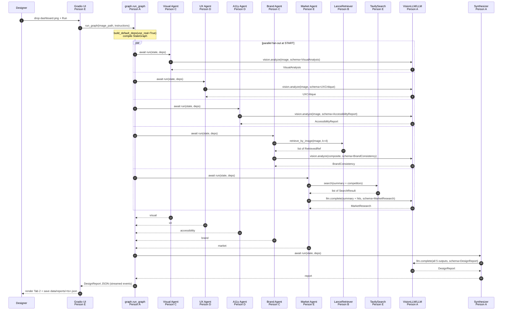

### Ownership at each step (quick-scan table)

Use this table to find your slice in the flow.

| Step | What happens | Who owns it | File |
|---|---|---|---|
| 1 | User drops image and clicks Run | Person E | `ui/app.py` |
| 2 | UI calls `run_graph(...)` | Person E -> Person A | `ui/app.py` -> `src/agents/graph.py` |
| 3 | `AgentDeps` is built with real impls | Person A | `src/agents/base.py` |
| 4 | Graph fans out to 5 agents in parallel | Person A | `src/agents/graph.py` (LangGraph) |
| 5a | Visual analysis branch | Person C | `src/agents/visual_analysis.py` |
| 5b | UX critique branch | Person D | `src/agents/ux_critique.py` |
| 5c | Accessibility branch | Person D | `src/agents/accessibility.py` |
| 5d | Brand consistency branch | Person C | `src/agents/brand_consistency.py` |
| 5e | Market research branch | Person E | `src/agents/market_research.py` |
| 6 | Brand agent calls retriever | Person C -> Person B | `brand_consistency.py` -> `src/rag/retriever.py` |
| 7 | Retriever embeds + queries LanceDB | Person B | `src/rag/embedder.py` + `vector_store.py` |
| 8 | Market agent calls web search | Person E | `src/tools/web_search.py` |
| 9 | Each agent calls the LLM | Person A | `src/llm/openrouter_client.py` + `multimodal.py` |
| 10 | Cost cache may short-circuit any LLM call | Person A | `src/llm/cost.py` |
| 11 | Synthesizer aggregates 5 outputs | Person A | `src/agents/synthesizer.py` |
| 12 | Report saved + UI renders | Person A + Person E | `synthesizer.py` -> `ui/app.py` |
| 12a | LangSmith trace recorded throughout | Person A | `src/utils/tracing.py` |
| 12b | Same flow callable from any MCP-compatible client | Person E | `src/mcp/server.py` |

### Data-shape evolution (how `GraphState` grows)

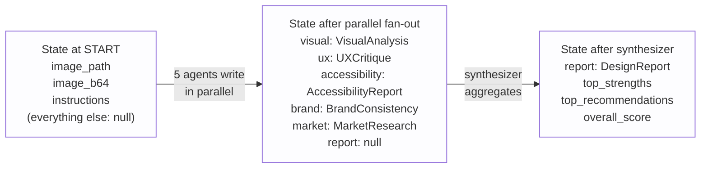

The state object only grows; no agent ever overwrites another agent's field. That is what makes parallel fan-out safe.

### Step 0 - The app is already running

```
$ make ui
Gradio listening on http://127.0.0.1:7860
```

- Owner: Person E (`ui/app.py`).
- Sprint concept: Sprint 2 - Gradio.

### Step 1 - the Designer uploads the image and clicks Run

- The Gradio file uploader saves `dashboard.png` to `data/uploads/2026-06-13T19-02-dashboard.png`.
- Person E's `on_run(image, instructions, model_tier)` handler is invoked.
- It calls `from src.agents.graph import run_graph` and yields a streaming generator that the UI displays as logs.

### Step 2 - The graph initializes

- Owner: Person A (`src/agents/graph.py`).
- `run_graph(image_path, instructions)` does:
  1. `deps = build_default_deps(use_real=True)` - constructs `AgentDeps` with `OpenRouterClient`, `OpenRouterVision`, `LanceRetriever`, `TavilySearch`.
  2. `state = GraphState(image_path=image_path, image_b64=..., instructions=instructions)`.
  3. `compiled = build_graph(deps)`.
  4. `for event in compiled.stream(state, config={"callbacks": [...]}): yield event`.

`GraphState` after Step 2 (every other field is `None`):

```json
{
  "image_path": "data/uploads/2026-06-13T19-02-dashboard.png",
  "image_b64": "iVBORw0KGgoAAA...",
  "instructions": "audience is retail banking customers in India",
  "visual": null, "ux": null, "accessibility": null, "brand": null,
  "market": null, "report": null
}
```

### Step 3 - LangGraph fans out to 5 parallel branches

- Sprint concept: Sprint 5/6 - LangGraph multi-agent parallel branches.
- The `START` node has 5 edges to: `visual`, `ux`, `accessibility`, `brand`, `market`. Each runs concurrently.

### Step 4 - Visual Analysis branch (Person C)

- File: `src/agents/visual_analysis.py:run(state, deps)`.
- It builds `system = prompts.visual_analysis_system()`, `user = "Analyze this design. Audience: retail banking customers in India."`.
- Calls `deps.vision.analyze(system=..., user=..., images=[state.image_path], schema=VisualAnalysis)` (Person A's `OpenRouterVision`, which talks to OpenRouter's gpt-4o-mini, which returns a JSON-schema-validated `VisualAnalysis`).
- Returns `{"visual": VisualAnalysis(...)}` to LangGraph; it merges into state.

### Step 5 - UX Critique branch (Person D)

- File: `src/agents/ux_critique.py:run(state, deps)`.
- Same shape, schema is `UXCritique`. Findings are tied to severity and evidence.

### Step 6 - Accessibility branch (Person D)

- File: `src/agents/accessibility.py:run(state, deps)`.
- Optional bonus: an opencv pass computes the minimum contrast ratio in the screenshot and seeds the prompt with `pre_computed_contrast=3.2:1`.
- Schema: `AccessibilityReport` with WCAG citations.

### Step 7 - Brand Consistency branch (Person C uses Person B)

- File: `src/agents/brand_consistency.py:run(state, deps)`.
- Step 7a: `refs = deps.retriever.retrieve_by_image(state.image_path, k=4)` -> Person B's `LanceRetriever`:
  - `embedder.embed_image(state.image_path)` -> 512-d CLIP vector.
  - `vector_store.query_by_vector(table, vec, k=4)` -> 4 nearest LanceDB rows.
  - Returns `[RetrievedRef(id=..., score=0.83, image_path=..., metadata={...}), ...]`.
- Step 7b: `composite = image_utils.side_by_side([candidate, *ref_imgs])` (one composite image for the LLM).
- Step 7c: `deps.vision.analyze(system=brand_system, user=..., images=[composite], schema=BrandConsistency)`.
- Returns `{"brand": BrandConsistency(consistency_score=0.78, color_drift=..., comparable_refs=refs)}`.

### Step 8 - Market Research branch (Person E)

- File: `src/agents/market_research.py:run(state, deps)`.
- Step 8a: short visual summary (re-uses `state.visual` if present, else a 1-sentence vision call).
- Step 8b: `hits = deps.search.search("fintech dashboard India retail banking competitors", k=5)` (Person E's `TavilySearch`).
- Step 8c: `deps.llm.complete(system=market_system, user=summary + hits, schema=MarketResearch)`.

### Step 9 - All 5 specialists have returned

`GraphState` now (each field is a fully-validated Pydantic object):

```json
{
  "image_path": "...", "image_b64": "...", "instructions": "...",
  "visual": { "palette": ["#0A2540","#FFC400", ...], "density_score": 0.62, ... },
  "ux": { "heuristic_violations": [{"title":"...","severity":"medium", ...}], ... },
  "accessibility": { "wcag_findings": [...], "contrast_pass": false, ... },
  "brand": { "consistency_score": 0.78, "comparable_refs": [...], ... },
  "market": { "competitors": [...], "trends": [...], "citations": [...] },
  "report": null
}
```

### Step 10 - Synthesizer node (Person A)

- File: `src/agents/synthesizer.py:run(state, deps)`.
- Builds a single JSON of all 5 specialist outputs.
- Calls `deps.llm.complete(system=synth_system, user=json_dump, schema=DesignReport)`.
- Receives `DesignReport(top_strengths=[...], top_recommendations=[...], overall_score=72.5, ...)`.
- Persists to `data/reports/2026-06-13T19-02-dashboard.json`.

### Step 11 - LangSmith trace lights up

- One trace, 6 child runs (one per agent), each with input/output/latency/cost.
- Sprint concept: Sprint 5 - LangSmith observability.

### Step 12 - UI renders the report

- Person E's `render_report(report)` populates Tab 2:
  - Header: overall score (72.5/100) + 3 strength bullets.
  - "Top Recommendations" table with effort vs impact chips.
  - Accordion sections - one per specialist, each rendering its findings with severity badges.
  - "Comparable References" gallery showing the 4 retrieved designs with similarity scores.
- The Designer scrolls through the report and shares it in Slack.

### Same flow, called from a coding-agent chat panel over MCP (Person E)

While the Designer's UI session is still up, an engineering teammate (let us call them **the Engineer**) opens a chat in their MCP-compatible coding agent (e.g. Claude Code):

```
@design-suite analyze_design data/uploads/dashboard.png
```

- The client talks stdio MCP to `python -m src.mcp.server`.
- The server invokes the same `run_graph(...)` and returns the same `DesignReport` JSON inline in chat.
- Sprint concept: Sprint 4 - MCP.

### Cost optimization in action (Person A)

If the Engineer runs the same image again 30 seconds later:

- `cost.cached` decorator hashes (system, user, images, schema, model).
- Hit on disk in `data/cache/<sha256>.json`.
- The whole graph returns in under 2 seconds for free.
- Sprint concept: Sprint 5 - cost optimization.

### Eval run (shared, infra by A)

```
$ make eval
Loaded 8 golden cases.
case 1: visual ✓ ux ✓ accessibility ✓ brand ✓ market ✓
...
Pass rate: 86%   Avg latency: 4.1s   Avg cost: $0.012
```

- Sprint concept: Sprint 4 - Evals.

## Each person's role in plain English

Pick the one that says your name. Show this paragraph to anyone who asks "what is your part of the project?".

### Person A - the plumber and the conductor

You build the pipes and you wave the baton. Nobody sees your code directly, but every other person's code flows through it. You own:

- The contracts (`src/contracts.py`) - the abstract shapes of an LLM, a vision LLM, a retriever, a web search. Every other person codes against these shapes.
- The fakes (`src/fakes/`) - hand-rolled stand-ins that satisfy each contract. Without your fakes, no other teammate can write a single line until everyone else is done. Your fakes are the unblock.
- The real LLM and vision-LLM clients on top of OpenRouter - the OpenAI-compatible API that powers everything (Sprint 1).
- The cost layer - response cache + cheap-vs-premium model selector (Sprint 5).
- The orchestrator (`src/agents/graph.py`) - LangGraph StateGraph that runs all 5 specialists in parallel and feeds the synthesizer (Sprint 5/6).
- The synthesizer agent - turns 5 JSON blobs into one `DesignReport`.
- LangSmith tracing setup - graceful no-op if no key (Sprint 5).
- The evals harness (Sprint 4).

If your work is solid, the team feels invincible. If it leaks, nothing works. Your demo magic moment: "watch all 5 agents run in parallel in this LangSmith trace - one click, four seconds, full report".

### Person B - the librarian

You give the system memory. Without you, "design analysis" is just a chatbot opinion - with you, the suite can say "this candidate is 83% similar to these 4 pre-existing brand designs". You own:

- CLIP embeddings (`src/rag/embedder.py`) - turn an image OR a text query into the same 512-d vector space (Sprint 3).
- LanceDB vector store (`src/rag/vector_store.py`) - the column-store that holds those vectors and supports k-NN search (Sprint 3).
- The retriever (`src/rag/retriever.py`) - implements Person A's `Retriever` protocol so the brand agent and the UI can call it without knowing how it works inside.
- LlamaIndex multimodal index (Sprint 3) - optional richer RAG path.
- The ingest CLI (`scripts/ingest_references.py`) - walks `data/reference/` and populates the DB.
- A LangChain `BaseTool` wrapper (Sprint 5 - LangChain tools concept) - so future agents can invoke retrieval via tool-use.

Your demo magic moment: "we have 30 reference designs in the corpus and the suite finds the 4 most similar to the candidate and uses them to ground the brand-consistency review."

### Person C - the eye and the brand cop

You see what is on the screen and whether it matches the brand. Two agents, one schema file. You own:

- The visual analysis agent (`src/agents/visual_analysis.py`) - objective layout, palette (validated as hex), typography, density score.
- The brand consistency agent (`src/agents/brand_consistency.py`) - the only agent that uses Person B's retriever. It pulls comparable references and asks the vision LLM to score drift.
- The schemas: `VisualAnalysis`, `BrandConsistency` in `src/schemas/outputs.py`.

Your demo magic moment: "the suite matched our candidate to 3 in-corpus designs and flagged 2 typography drifts, with side-by-side evidence."

### Person D - the user advocate

You speak for the user. Two agents, two specialised lenses. You own:

- The UX critique agent (`src/agents/ux_critique.py`) - Nielsen's heuristics, cognitive load, friction points, all tied to evidence and severity.
- The accessibility agent (`src/agents/accessibility.py`) - WCAG 2.2 audit, with optional opencv contrast measurement that runs deterministically alongside the LLM.
- The schemas: `UXCritique`, `AccessibilityReport`.

Your demo magic moment: "the suite caught a 3.2:1 contrast ratio on the secondary CTA - measured by opencv, confirmed by the LLM, cited as WCAG 1.4.3."

### Person E - the storyteller

You are the demo surface. You are also the only person whose code talks to the outside world. You own:

- The Gradio UI (`ui/app.py`) - upload, streaming progress, structured report tabs, references gallery, settings (Sprint 2).
- The market research agent (`src/agents/market_research.py`) - chains a short summary, real web search, and JSON-mode synthesis (Sprint 1 + Sprint 5 patterns).
- The web search tool (`src/tools/web_search.py`) - Tavily preferred, DuckDuckGo fallback, implements Person A's `WebSearch` protocol.
- The MCP server (`src/mcp/server.py`) - exposes `analyze_design` and `search_designs` so external coding agents (Claude Code or any other MCP-compatible client) can call the suite (Sprint 4).

Your demo magic moment: "judges, watch as I call analyze_design from inside an MCP-compatible coding agent - same report appears in chat, no UI in sight."

## The full project in five paragraphs

### What it is

The Multimodal AI Design Analysis Suite is a multi-agent system that reviews UI/product design screenshots the way a senior design panel would. A user uploads an image; five specialist agents look at it from five angles - visual properties, UX heuristics, accessibility, brand consistency against an in-house corpus, and market context - and a synthesizer agent turns their structured outputs into one prioritized report with effort-vs-impact recommendations.

### Why it matters

Design review is expensive and inconsistent. Designers wait days for senior feedback; senior reviewers see the same problems repeatedly; engineers ship designs without an accessibility lens. This suite gives every designer instant, evidence-cited, multi-perspective feedback before review meetings happen. Reviewers spend their time on judgement, not on flagging contrast ratios.

### How it works

Each upload triggers a LangGraph StateGraph that fans out to five agents in parallel. Vision-capable LLMs (via OpenRouter, OpenAI-compatible) read the image directly. The brand agent uses CLIP-image embeddings stored in LanceDB to retrieve the four most-similar reference designs and grounds its review in concrete comparisons. Every agent emits a Pydantic-validated JSON object, which the synthesizer collapses into a single `DesignReport`. LangSmith captures every step; a cost layer caches responses and tiers models cheap-to-premium so re-running a demo is free.

### What each accelerator concept becomes

Sprint 1 (prompt engineering, JSON-mode, OpenAI standard) lives in every agent prompt and in `src/llm/openrouter_client.py`. Sprint 2 (Gradio, HuggingFace) is the UI plus an optional local-model fallback. Sprint 3 (RAG, LanceDB, LlamaIndex) is the entire `src/rag/` package and the brand agent. Sprint 4 (Codex, Evals, MCP) is the evals harness and the MCP server that exposes the suite to other coding agents. Sprint 5 (LangChain, LangGraph, LangSmith, cost optimization) is the orchestrator, tool wrappers, tracing, and the cost layer. Sprint 6 (parallel multi-agent agents) is the StateGraph fan-out itself.

### What we did not build (honest stretch list)

We did not implement an n8n webhook trigger or a Discord bot interface - both Sprint 1/6 surfaces, but they are extra UIs and add no analytical value, so we cut them. We did not fine-tune any model. The cost layer caches but does not tier across providers - tiering is one function rewrite away. The evals harness is schema-validity-only; LLM-as-judge is a clean post-MVP extension. The MCP server runs locally over stdio and is not deployed. We did not build a learning loop where agents improve from past reports. Each of those is a one-day task, not an architecture change.

## How everything connects (one-page cheat sheet)

The single table every teammate should screenshot.

- **What the user clicks** -> `ui/app.py` (Person E) -> `run_graph` (Person A).
- **What `run_graph` calls** -> 5 agent `run(state, deps)` functions in parallel + 1 synthesizer.
- **Where each agent gets its tools** -> from the shared `AgentDeps` container (Person A) which holds:
  - `LLMClient` -> `OpenRouterClient` (Person A) or `FakeLLM` (Person A)
  - `VisionLLM` -> `OpenRouterVision` (Person A) or `FakeVisionLLM` (Person A)
  - `Retriever` -> `LanceRetriever` (Person B) or `FakeRetriever` (Person A)
  - `WebSearch` -> `TavilySearch` (Person E) or `FakeSearch` (Person A)
- **What each agent returns** -> a `dict` with one key, one Pydantic-validated object:
  - `visual_analysis.py` (Person C) -> `{"visual": VisualAnalysis}`
  - `ux_critique.py` (Person D) -> `{"ux": UXCritique}`
  - `accessibility.py` (Person D) -> `{"accessibility": AccessibilityReport}`
  - `brand_consistency.py` (Person C) -> `{"brand": BrandConsistency}`
  - `market_research.py` (Person E) -> `{"market": MarketResearch}`
- **Who aggregates** -> `synthesizer.py` (Person A) -> emits `DesignReport`.
- **Where the report is displayed** -> Gradio Tab 2 (Person E) AND `data/reports/<...>.json` (any reader).
- **Who can also call the suite** -> external coding agents via `src/mcp/server.py` (Person E).
- **Where every accelerator concept "shows up" for the judges** -> `docs/CONCEPT_COVERAGE.md` (shared).

If you can answer "where does my code show up in this list?" and "what protocol from `src/contracts.py` does my code consume or implement?", you understand the whole project.
